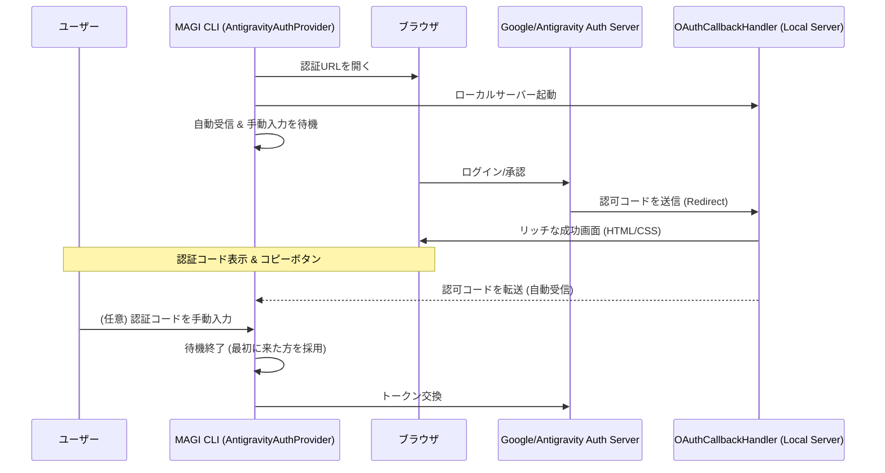
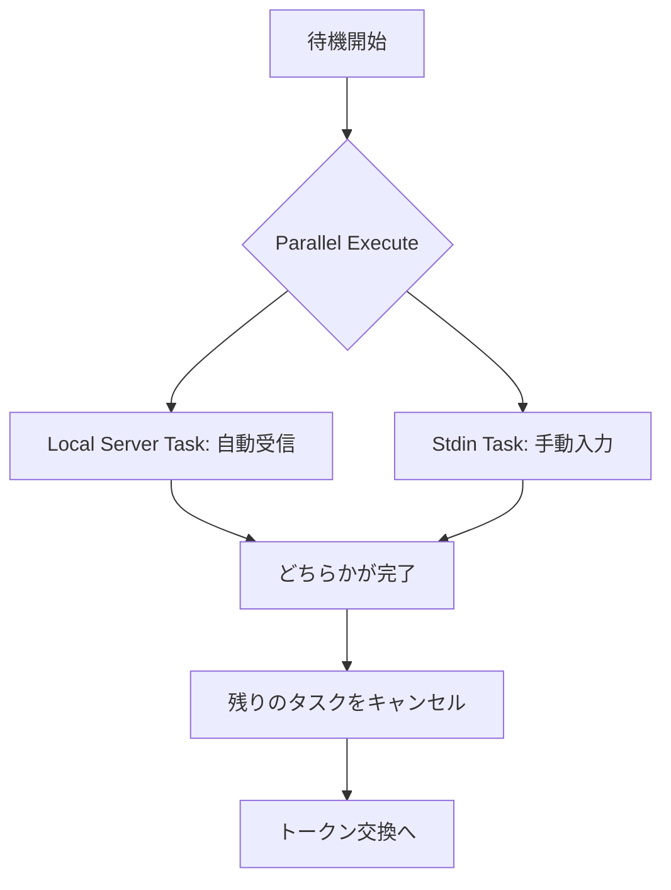

# Design Document: 認証フローの改善 (Auth Flow Improvement)

---
**Purpose**: CLI認証プロセスにおけるユーザーエクスペリエンスを向上させる。ブラウザでの成功画面の視認性を高め、自動連携失敗時の手動フォールバックを確実にする。
---

## Overview
本機能は、MAGI CLIの `magi auth login antigravity` コマンド等で使用される認証フローを改善します。現在のシンプルなHTMLレスポンスを、モダンなデザインの成功ページに置き換え、ユーザーが次に何をすべきか（ターミナルに戻る、またはコードをコピーする）を明確に伝えます。

また、CLI側ではローカルサーバーからの自動受信と標準入力からの手動入力を同時に待機するように変更し、ネットワーク環境やブラウザの制限により自動連携が失敗した場合でも、ユーザーがスムーズに認証を完了できるようにします。

### Goals
- ブラウザ上の認証成功画面を視認性の高いモダンなデザインにする。
- 認証コードを明確に表示し、ワンクリックでコピーできるようにする。
- CLI側で自動受信と手動入力の両方をサポートするハイブリッド待機ロジックを実装する。
- 認証待機中のCLIメッセージを分かりやすく改善する。

### Non-Goals
- OAuth 2.0 自体の認証プロトコルの変更。
- 認証サーバー側のロジック変更。
- `keyring` への保存方法の変更。

## Architecture

### Architecture Pattern & Boundary Map
本機能は、既存の `AntigravityAuthProvider` と `OAuthCallbackHandler` の責務を拡張します。



### Technology Stack
| Layer | Choice / Version | Role in Feature | Notes |
|-------|------------------|-----------------|-------|
| Frontend | HTML5, CSS3, Vanilla JS | 認証成功画面 | 外部依存なし、インライン実装 |
| Backend | Python 3.11+ | 認証ロジック、待機ロジック | `asyncio` を使用 |

## System Flows

### ハイブリッド認証待機フロー
CLI側では、`asyncio.wait` を使用して、ローカルサーバーからのコード受信タスクと、標準入力からの読み取りタスクを並行して実行します。



## Requirements Traceability

| Requirement | Summary | Components | Interfaces | Flows |
|-------------|---------|------------|------------|-------|
| 1.1 | リッチな成功画面 | `OAuthCallbackHandler` | HTML/CSS | Redirect Flow |
| 1.3 | 認証コードの表示 | `OAuthCallbackHandler` | UI | Redirect Flow |
| 1.4 | コピーボタン | `OAuthCallbackHandler` | JS | Redirect Flow |
| 2.1 | ハイブリッド待機 | `AntigravityAuthProvider` | `login` method | Hybrid Wait Flow |

## Components and Interfaces

### [Core / Auth]

#### AntigravityAuthProvider
| Field | Detail |
|-------|--------|
| Intent | Google/Antigravityプロバイダーの認証を管理する |
| Requirements | 2.1, 2.2, 2.3, 2.4 |

**Responsibilities & Constraints**
- ローカルサーバーを起動し、認可コードを待機する。
- ユーザーに対して認証URLを表示し、ブラウザを開く。
- **(変更)** `asyncio.Queue` 等を利用し、サーバーからの通知と `aioconsole` 等による標準入力を同時に待機する。

#### OAuthCallbackHandler
| Field | Detail |
|-------|--------|
| Intent | 認証後のリダイレクトを受け取り、HTMLレスポンスを返す |
| Requirements | 1.1, 1.2, 1.3, 1.4, 1.5 |

**Responsibilities & Constraints**
- HTTP GETリクエストから `code` パラメータを抽出する。
- 成功時、またはエラー時に適切なHTMLレスポンスを生成してブラウザに返す。
- **(変更)** 返却するHTMLをシンプルな文字列から、デザインされたモダンなHTML/CSSに変更する。

## UI Design (認証成功画面)

認証成功時に `OAuthCallbackHandler` から返却されるHTMLの構造案です。

```html
<!DOCTYPE html>
<html lang="ja">
<head>
    <meta charset="UTF-8">
    <meta name="viewport" content="width=device-width, initial-scale=1.0">
    <title>Authentication Successful</title>
    <style>
        body {
            font-family: -apple-system, BlinkMacSystemFont, "Segoe UI", Roboto, sans-serif;
            background-color: #f4f7f6;
            display: flex;
            justify-content: center;
            align-items: center;
            height: 100vh;
            margin: 0;
        }
        .card {
            background: white;
            padding: 2rem;
            border-radius: 12px;
            box-shadow: 0 4px 20px rgba(0,0,0,0.1);
            text-align: center;
            max-width: 400px;
            width: 90%;
        }
        .icon {
            color: #4CAF50;
            font-size: 48px;
            margin-bottom: 1rem;
        }
        h1 { font-size: 24px; color: #333; margin-bottom: 0.5rem; }
        p { color: #666; line-height: 1.5; margin-bottom: 1.5rem; }
        .code-container {
            background: #f0f0f0;
            padding: 1rem;
            border-radius: 6px;
            display: flex;
            align-items: center;
            justify-content: space-between;
            margin-bottom: 1rem;
        }
        .code { font-family: monospace; font-size: 16px; color: #333; word-break: break-all; }
        .copy-btn {
            background: #2196F3;
            color: white;
            border: none;
            padding: 8px 16px;
            border-radius: 4px;
            cursor: pointer;
            font-size: 14px;
            transition: background 0.2s;
            white-space: nowrap;
            margin-left: 10px;
        }
        .copy-btn:hover { background: #1976D2; }
        .footer { font-size: 12px; color: #999; }
    </style>
</head>
<body>
    <div class="card">
        <div class="icon">✓</div>
        <h1>認証に成功しました</h1>
        <p>このウィンドウを閉じて、ターミナルに戻ってください。</p>
        
        <div class="fallback">
            <p style="font-size: 14px; margin-bottom: 8px;">自動的に反応しない場合は、以下のコードをコピーしてターミナルに貼り付けてください：</p>
            <div class="code-container">
                <span class="code" id="auth-code">{AUTH_CODE}</span>
                <button class="copy-btn" onclick="copyCode()">コピー</button>
            </div>
        </div>
        
        <div class="footer">MAGI System - Advanced Agentic Coding</div>
    </div>
    <script>
        function copyCode() {
            const code = document.getElementById('auth-code').innerText;
            navigator.clipboard.writeText(code).then(() => {
                const btn = document.querySelector('.copy-btn');
                btn.innerText = 'コピー完了';
                setTimeout(() => btn.innerText = 'コピー', 2000);
            });
        }
    </script>
</body>
</html>
```

## Error Handling

### Error Strategy
- ブラウザ上のHTML表示:
    - パラメータ不足やエラー時は、赤い警告色を使ったエラー専用デザインで表示する。
- CLI上の待機:
    - ローカルサーバーの起動失敗時は、自動的に手動入力モード（サーバーなし）へフォールバックする。
    - タイムアウト時は「認証がタイムアウトしました。再度実行してください。」と表示する。

## Testing Strategy

### Unit Tests
- `OAuthCallbackHandler` が生成するHTMLに認証コードが正しく埋め込まれているか。
- 手動入力パースロジック（コード単体、またはURL全体）の検証。

### Integration Tests
- 認証フローのシミュレーション。
- 自動受信タスクが完了した際、手動入力待ちが正しくキャンセルされるか。
