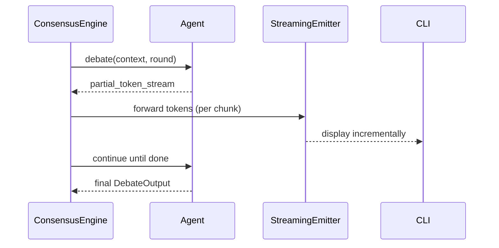
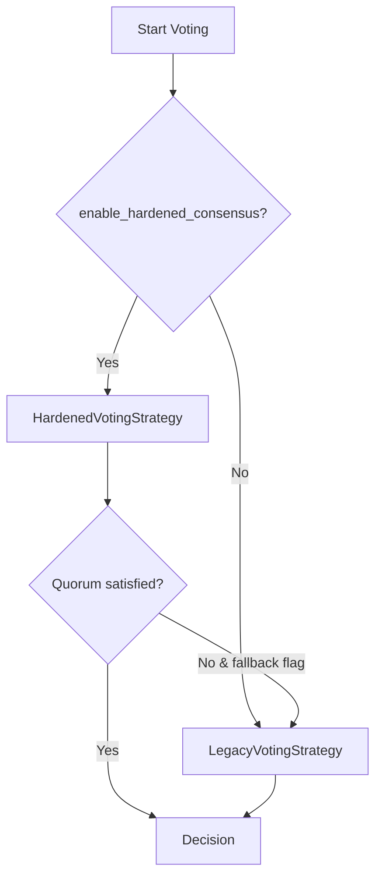

# 技術設計書: consensus-engine-hardening-2

## Overview
本機能は合議エンジンの性能・保守性・セキュリティを強化し、CLI 利用者が高速かつ安全に思考・議論・投票結果を得られるようにする。ターゲットはコードレビューや仕様検証で MAGI を活用する開発チームであり、ストリーミング可視化と堅牢なリトライ/投票/ガードを提供して体感レイテンシとリスクを低減する。

### Goals
- Debate フェーズの体感レイテンシ低減（ストリーミング/パイプライン化）
- LLM リトライのサージ抑制（Full Jitter バックオフ）
- DI 化と Voting Strategy 抽象化による疎結合化とテスト容易性向上
- セキュリティ多層化（Guardrails 追加、プラグイン署名検証強化）

### Non-Goals
- 新規データストアの導入
- 投票アルゴリズム自体の変更（閾値・集計ロジックは維持）
- CLI UX の大幅改変（表示形式は現行踏襲、逐次出力を追加する範囲）

## アーキテクチャ

### 既存アーキテクチャ分析
- 合議パイプライン: Thinking → Debate (ラウンドごと同期) → Voting（新旧ロジック混在）
- LLMClient は ConsensusEngine 内で直接生成し、Agent に注入しているためモック困難。
- SecurityFilter は正規表現ベース、PluginLoader は署名フィールドを保持するが検証せず。

### 高レベルアーキテクチャ
```mermaid
graph TD
  CLI[CLI] --> CE[ConsensusEngine]
  CE --> Think[Thinking Phase]
  CE --> Debate[Debate Phase (Streaming/Pipeline)]
  CE --> Vote[Voting Phase (Strategy)]
  Debate --> Agents[Agents]
  Vote --> Agents
  Agents --> LLM[LLMClient (DI/Streaming)]
  CE --> Guard[SecurityFilter + Guardrails]
  CE --> Plugins[PluginLoader + SignatureValidator]
```

### 技術整合性
- 既存スタック（Python 3.11、asyncio、unittest）を踏襲。
- LLMClient は DI/ファクトリ化するのみで新規ベンダー追加はしない。
- Guardrails 追加時も内部でオプションフラグ制御し、既存 SecurityFilter を温存。
- Plugin 署名検証は cryptography 系ライブラリ（既存依存と競合しないもの）を想定し、外部 I/O を増やさない。

### 主要設計判断
- **Decision**: LLMClient を ConsensusEngine へ依存性注入し、テスト時にモック可能にする。
  - **Context**: `_create_agents` で直接生成しておりモックが困難。
  - **Alternatives**: (1) 現状維持＋モンキーパッチ、(2) グローバルシングルトン、(3) コンストラクタ/ファクトリ注入。
  - **Selected Approach**: (3) コンストラクタ/ファクトリ注入でデフォルトファクトリを設定。
  - **Rationale**: 後方互換を保ちつつテスト容易性と差し替え柔軟性を獲得。
  - **Trade-offs**: 初期化引数が増えるが設定値を束ねるファクトリで緩和。
- **Decision**: Voting を Strategy 抽象で分離し、Legacy を明示的フォールバックにする。
  - **Context**: 新旧ロジックが `_run_voting_phase` に混在し可読性低下。
  - **Alternatives**: (1) if 分岐維持、(2) Legacy 削除、(3) Strategy 抽象＋フォールバック。
  - **Selected Approach**: (3) Strategy インターフェース導入し Hardened/Legacy 実装を切替。
  - **Rationale**: 段階的廃止計画を取りつつハードニング経路を明確化。
  - **Trade-offs**: クラス増加と切替コードが必要だが責務が明瞭に。
- **Decision**: LLM リトライに Full Jitter を適用し、Debate/Vote のストリーミングは feature flag で段階導入。
  - **Context**: 同期リトライでサージが起きうる。ストリーミングは UX 向上だがリスクあり。
  - **Alternatives**: (1) 既存指数のみ、(2) 固定ジッター、(3) Full Jitter＋フラグ制御ストリーミング。
  - **Selected Approach**: (3) を採用し安全に展開。
  - **Rationale**: サージ抑制と段階リリースを両立。
  - **Trade-offs**: 乱数依存で再現性がわずかに下がるがログで追跡可能。

## システムフロー
### Debate ストリーミング・パイプライン（概念）


### Voting Strategy 切替


## 要件トレーサビリティ
| 要件/課題 | 要約 | 対応コンポーネント | インターフェース/フロー |
|---|---|---|---|
| Debate 直列性/UX | ストリーミング＋パイプライン化 | ConsensusEngine + StreamingEmitter | Sequence: Debate Streaming |
| リトライにジッター | Full Jitter バックオフ | LLMClient | `_retry_with_backoff` |
| LLMClient DI | 疎結合化・テスト容易性 | ConsensusEngine / LLMClientFactory | コンストラクタ注入 |
| Voting 混在 | Strategy 分離＋フォールバック | VotingStrategy(H/L) | Flow: Voting Strategy |
| Guardrails | 意味的入力防御層追加 | SecurityGuardrailsAdapter | SecurityFilter 呼出前後 |
| 署名検証 | プラグイン真正性確認 | PluginSignatureValidator | PluginLoader.validate/load |

## コンポーネントとインターフェース

### ConsensusEngine 拡張
- **責務**: LLMClient ファクトリ受け取り、Agent 生成に利用。Debate/Vote でストリーミングと Strategy 切替を統合。
- **依存**: Config, TemplateLoader, SchemaValidator, SecurityFilter, TokenBudgetManager, QuorumManager, StreamingEmitter。
- **契約 (Python 型イメージ)**:
```python
class LLMClientFactory(Protocol):
    def __call__(self) -> LLMClient: ...

class ConsensusEngine:
    def __init__(..., llm_client_factory: LLMClientFactory | None = None, ...): ...
```

### LLMClient（ジッター対応）
- **責務**: LLM 呼び出しとバックオフ制御。Full Jitter でサージを回避。
- **契約**:
```python
def _retry_with_backoff(self, request: LLMRequest) -> LLMResponse:
    """Full Jitter を用いた指数バックオフ。"""
```

### DebateStreamingEmitter（新規/拡張）
- **責務**: エージェントからのトークンストリームを逐次 CLI へ転送。ログ/再試行は持たない薄いアダプタ。
- **契約**:
```python
class StreamingEmitter(Protocol):
    async def emit(self, persona: str, chunk: str, phase: str, round: int | None = None) -> None: ...
```

### VotingStrategy 抽象
- **責務**: 投票処理の切替点を単純化し、Hardened/Legacy を独立実装。
- **契約**:
```python
class VotingStrategy(Protocol):
    async def vote(self, context: str) -> VoteResult: ...
```
- **実装**:
  - HardenedVotingStrategy: クオーラム、スキーマリトライ、フェイルセーフを担当。
  - LegacyVotingStrategy: 既存挙動を維持し、フォールバック用に限定。

### SecurityGuardrailsAdapter
- **責務**: SecurityFilter の前後で LLM ベースのガードを挿入（feature flag 制御）。
- **契約**:
```python
class GuardrailsAdapter(Protocol):
    async def check(self, prompt: str) -> GuardResult: ...
```
- **適用順序とフォールバック**: Guardrails → SecurityFilter → Template/Schema 検証。ガードがタイムアウト・モデル障害時は `fail-closed`（ブロック）を既定とし、運用フラグで `fail-open` も選択可能にする。タイムアウトは config 駆動とし、デフォルト 3s とする。
- **設定キーと階層**:
  - グローバル: `guardrails.timeout_seconds`（int, 既定 3）、`guardrails.on_timeout_behavior`（`fail-closed`/`fail-open`、既定 `fail-closed`）、`guardrails.on_error_policy`（同上）。
  - プロバイダごと: `guardrails.providers.{name}.enabled`（bool）、`guardrails.providers.{name}.model`、`guardrails.providers.{name}.endpoint`、`guardrails.providers.{name}.timeout_seconds`、`guardrails.providers.{name}.on_error_policy`（未設定時はグローバル継承）。
  - 例:
    ```yaml
    guardrails:
      timeout_seconds: 3
      on_timeout_behavior: fail-closed
      on_error_policy: fail-closed
      providers:
        llama_guard:
          enabled: true
          model: meta-llama/llama-guard-3-8B
          endpoint: https://guard.example.com/v1/check
          timeout_seconds: 2   # プロバイダ上書き
          on_error_policy: fail-open
    ```
- **プロバイダ指針**: Llama Guard 等の意味検知モデルを想定し、プロバイダ名・モデル名・エンドポイントを config で差し替え可能にする。モデル例: `meta-llama/llama-guard-3-8B`（2025-02-12）、`meta-llama/llama-guard-4-12B`（2025-04-30）。ライセンスは Meta Llama Community License に従い、商用利用可否や Acceptable Use 制限を運用前に確認すること（Apache 2.0 ではない点に注意）。プロバイダ差替えやモデル更新は config で行うこと。

### PluginSignatureValidator
- **責務**: `PluginMetadata.signature` を公開鍵で検証。ハッシュと併用して完全性＋真正性を確保。
- **契約**:
```python
class PluginSignatureValidator(Protocol):
    def validate(self, content: str, signature: str, public_key_pem: str) -> None: ...
```
- **統合ポイント**: `PluginLoader.load/validate` で署名検証し、失敗時は MagiException を発生。
- **署名対象と鍵管理**: YAML 文字列を正規化（CRLF→LF、末尾空白除去）した上で署名/検証。公開鍵は設定ファイルまたは `MAGI_PLUGIN_PUBKEY_PATH` からロードし、再読み込み可能にする。検証失敗時は PLUGIN_YAML_PARSE_ERROR 相当でブロックし、ログに path・署名有無・鍵識別子を記録。
- **ライブラリとスレッド安全性**:
  - 利用ライブラリ: `cryptography` (PyCA) >= 42.0.0 を最低バージョンとし、既存依存と競合しないことを前提に採用する。
  - 排他制御: 公開鍵のリロードは `asyncio.Lock`（非同期経路）または `threading.RLock`（同期経路）で保護し、同時実行時の race を防ぐ。Validator が async 化される場合は `await self._key_lock.acquire()` でロック取得。
  - 鍵形式: PEM（PKCS#1/PKCS#8）をサポート対象とし、DER/他形式はエラーメッセージで不対応理由（可読性・運用性と秘密鍵漏洩リスク低減のため）を明示する。

## データモデル
- 永続データは追加しない。Strategy/Factory/Validator はメモリ内オブジェクトで完結。

## エラーハンドリング
- LLM リトライ: Full Jitter で `retry_count` まで実行し、失敗時に MagiException を送出。
- Debate/Vote: 各エージェント失敗はログ＋除外、クオーラム未達時は fail-safe を返却し event ログに残す。
- 署名検証: 失敗時は PLUGIN_YAML_PARSE_ERROR 相当で即時中断。ガード失敗時は blocked として拒否。
- MagiException 階層とエラーコード
  - 階層: `MagiException` を基底に `ValidationException`（入力/スキーマ）、`SecurityException`（Guardrails/署名）、`PluginValidationException`（プラグイン構文/署名）、`RetryableException`（一時的エラー）を派生させる。Guardrails 時間超過は `GuardrailsTimeoutException(SecurityException)`、モデル応答異常は `GuardrailsModelException(SecurityException)` とする。
  - エラーコードとログレベル:
    | error_code | 例外クラス | log level | 説明 |
    | --- | --- | --- | --- |
    | PLUGIN_YAML_PARSE_ERROR | PluginValidationException | ERROR | YAML 構文不正・署名不一致でブロック |
    | SIGNATURE_VERIFICATION_FAILED | SecurityException | ERROR | 署名検証失敗（鍵不一致/破損） |
    | GUARDRAILS_TIMEOUT | GuardrailsTimeoutException | ERROR | Guardrails 応答タイムアウト（config timeout 遵守） |
    | GUARDRAILS_BLOCKED | GuardrailsModelException | ERROR | モデルが危険と判定しブロック |
    | GUARDRAILS_FAIL_OPEN | GuardrailsModelException | CRITICAL | fail-open 設定で通過した場合の監査ログ |
    | RETRY_EXHAUSTED | RetryableException | ERROR | LLM 再試行枯渇 |
  - ログ方針: Security/Plugin 系は path・鍵 ID・プロバイダ名を構造化ログに含め、CRITICAL はアラート連携対象とする。

## テスト戦略
- Unit
  - ConsensusEngine がカスタム LLMClient を受け取れること（DI）。
  - `_retry_with_backoff` がジッター範囲内の待機を行うこと（モックで検証）。
  - VotingStrategy 切替の分岐（ハードニング有効/無効、フォールバック有効）。
- Integration
  - Debate ストリーミングフラグ ON で逐次 emit が呼ばれること（テスト用 emitter で記録）。
  - PluginLoader が署名不正で例外を投げること。
- Property/Regression
  - QuorumManager と Strategy の組み合わせでクオーラム閾値が守られること。

## セキュリティ考慮
- Guardrails を SecurityFilter 前段に追加し、多言語/難読化パターンを検知。
- プラグイン署名検証で改ざんを阻止。公開鍵の取得元は設定で指定し、鍵ローテーション時は再読込可能に。
- ストリーミング出力はサニタイズ後に送出し、制御文字を除去。
- Guardrails タイムアウト時の既定挙動はブロック（fail-closed）。運用で許容する場合に限り `fail-open` フラグを明示的に設定する。

## パフォーマンス & スケーラビリティ
- ストリーミングにより待機体感を削減。バック圧が必要な場合は emitter 側で非同期キューを挿入可能とする。
- Full Jitter でレートリミット時の同時再試行を分散。
- テンプレート/スキーマキャッシュは既存の TemplateLoader/SchemaValidator を継続利用。
- StreamingEmitter はキュー長と emit タイムアウトを config で設定（例: `streaming.emitter.queue_size`, `streaming.emitter.emit_timeout_seconds`、デフォルト 2s）し、溢れた場合は最新優先で古いチャンクを破棄しつつ警告ログを出す。ストリーム途中で TokenBudgetManager が要約を適用する場合はストリームを中断し fail-safe を返す。

## マイグレーション戦略
```mermaid
flowchart LR
  P0[Phase0 現行] --> P1[Phase1 DI+Jitter+Signature+Strategy追加 (フラグOFF)]
  P1 --> P2[Phase2 Debate/Vote ストリーミング・Guardrails をフラグONで試験]
  P2 --> P3[Phase3 デフォルトON/Legacy縮退・後日削除]
```
- フラグ: `enable_hardened_consensus`, `legacy_fallback_on_fail_safe`, `enable_streaming_output`, `enable_guardrails`（新設予定）。
- ロールバック: フラグを OFF に戻すだけで旧経路に復帰できる構成を維持。
