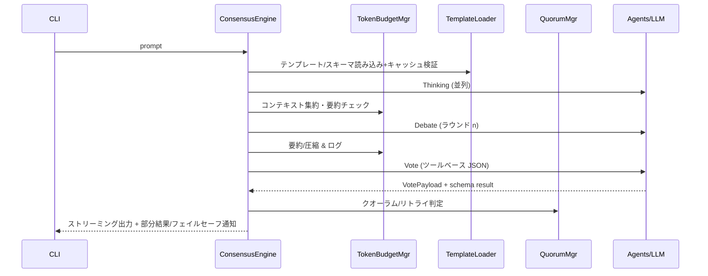
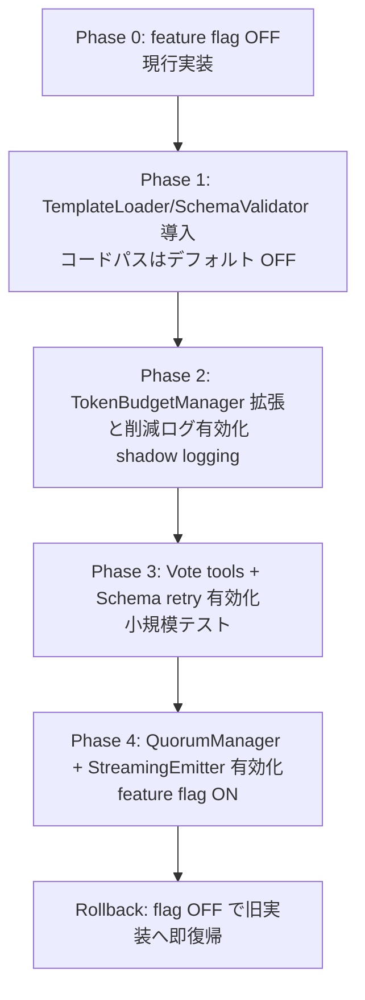

# 設計ドキュメント - consensus-engine-hardening

## Overview
本機能は既存の ConsensusEngine を拡張し、トークン予算超過を抑制しつつストリーミング応答で体感速度を高め、構造化出力とテンプレート外部化で再現性を確保し、クオーラム管理とセキュリティ強化で誤判定と攻撃リスクを低減する。CLI ユーザーと運用者が、安定かつ安全な合議結果を得ることが目的である。

### Goals
- トークン予算を超過せずに思考・議論・投票コンテキストを保持し、要約/圧縮を自動化すること。
- 投票出力をスキーマ準拠の JSON（ツールベース）に統一し、テンプレートを外部管理かつホットリロード可能にすること。
- エージェント障害時のクオーラム/リトライを制御し、安全なストリーミング応答と詳細ログを提供すること。

### Non-Goals
- 新規ペルソナの追加や LLM モデル変更。
- 永続ストレージや外部キーバリューストアの導入。
- CLI のコマンド体系変更や新 UI の導入。

## Architecture

### Feature Type と既存アーキテクチャの観察
- 種別: 既存システム拡張（ConsensusEngine/Agent/ContextManager の強化）。
- 現状: Thinking→Debate→Voting を直列実行。LLMClient は非ストリーミング呼び出し。ContextManager は単純な文字数ベース推定と FIFO 削除のみ。投票はフリーフォーム JSON を正規表現抽出し、スキーマ検証やツール呼び出しなし。クオーラムやリトライ、部分結果の扱いは未実装。テンプレートはコード埋め込みで外部管理なし。セキュリティは入力エスケープ/ブラックリスト運用が未統合。

### High-Level Architecture
```mermaid
graph TB
  U[CLI] -->|prompt/stream| CE[ConsensusEngine]
  CE --> QM[QuorumManager<br/>RetryController]
  CE --> TB[TokenBudgetManager<br/>(ContextManager拡張)]
  CE --> TL[TemplateLoader<br/>+Cache]
  CE --> SV[SchemaValidator]
  CE --> SE[StreamingEmitter]
  CE --> SF[SecurityFilter/PluginGuard]
  CE --> AG[Agents]
  AG --> LC[LLMClient (Anthropic)]
  TL --> TS[Template Store (yaml/json/j2)]
  SV --> JS[JSON Schema]
```

### Technology Alignment
- 既存スタック（Python 3.11, AsyncAnthropic, unittest/hypothesis, uv）を維持。
- 追加予定ライブラリ: `jsonschema`（スキーマ検証）、`orjson` または `json`（高速シリアライズ）、`tiktoken` 互換のトークン推定/制御、`asyncio` 標準ストリーミングハンドリング。追加依存は最小限に留める。
- 新規サービス/インフラ導入なし。テンプレートはローカルファイル/URL 読み込みとキャッシュで対応。

### Key Design Decisions
- **Decision**: トークン予算管理を「階層的要約＋重要度圧縮」で行う  
  **Context**: Debate/ Voting で 8k+ トークンに到達しやすく、単純切り捨ては意味喪失につながる。  
  **Alternatives**: (a) 固定長スライドウィンドウ、(b) 低品質短縮（先頭/末尾切り捨て）、(c) LLM 要約＋重要度ソート。  
  **Selected Approach**: (c) を採用し、ContextManager 拡張で段階的に (1) 粗いトークン推定、(2) LLM 要約またはキーフレーズ抽出、(3) 重要度順でトリミングを実施。削減ログと指標を記録。  
  **Trade-offs**: LLM 呼び出し増によるレイテンシ上昇 vs. 情報保持性・再現性向上。

- **Decision**: 投票出力を JSON Schema + ツールベースの出力に統一  
  **Context**: 現状は正規表現抽出＋パース失敗時の条件付きフォールバックでスキーマ保証が弱い。  
  **Alternatives**: (a) 文字列パース継続、(b) pydantic でバリデーション、(c) Anthropic tools/JSON Schema 連携＋再試行。  
  **Selected Approach**: (c) を採用し、LLM tools に VotePayload スキーマを渡し、`jsonschema` で検証、失敗時に上限付きリトライと WARN/ERROR ログを出力。  
  **Trade-offs**: ツール呼び出し前提によりプロンプト自由度が減るが、再現性と監査性を確保。

- **Decision**: クオーラム欠損時はフェイルセーフ優先のステートマシン化  
  **Context**: 部分結果を返すと誤判定リスクがある。  
  **Alternatives**: (a) ベストエフォート返却、(b) 常に再試行後に返却、(c) フェーズ別クオーラム/リトライ閾値を持つステートマシン。  
  **Selected Approach**: (c) を採用し、フェーズ毎に「有効エージェント数」「リトライ残数」「部分結果フラグ」を管理。クオーラム未達なら即フェイルセーフを返し、部分結果はログのみ保持。  
  **Trade-offs**: 成果物が返らないケースが増えるが、安全性と透明性を優先。

## System Flows

### 合議フローとストリーミング


### テンプレートリロードと検証フロー
```mermaid
graph TD
  RQ[リロード要求/TTL失効/強制] --> TL[TemplateLoader]
  TL --> VL[形式・必須フィールド検証]
  VL --> SV[JSON Schema 読込]
  SV --> CC[キャッシュ生成 (versioned)]
  CC -->|成功| SW[アトミックスワップ]
  CC -->|失敗| RB[ロールバック+警告ログ]
```

## Requirements Traceability
| Requirement | Components | Interfaces/Flows | Notes |
|-------------|------------|------------------|-------|
| 1.1–1.4 トークン最適化 | TokenBudgetManager, ContextManager, Logging | 合議フロー/TokenBudget API | 要約ログと指標記録 |
| 2.1–2.6 構造化出力/テンプレート | SchemaValidator, TemplateLoader, Cache | Vote ツール呼び出し、リロードフロー | JSON Schema + TTL/force reload |
| 3.1–3.7 クオーラム/フェイルセーフ | QuorumManager, RetryController, StreamingEmitter | 合議フロー、フェイルセーフ応答 | 部分結果はログのみ |
| 4.1–4.5 セキュリティ強化 | SecurityFilter, PluginGuard, Logging | 入力サニタイズ/検知、プラグイン検証 | 付録Aルール適用 |

## Components and Interfaces

### Consensus / Control
#### ConsensusEngine
- **Primary Responsibility**: Thinking→Debate→Voting のオーケストレーションとフェーズ遷移。
- **Domain Boundary**: 合議プロセス制御。
- **Data Ownership**: セッション単位のフェーズ状態、最終決定、エラーリスト。
- **Dependencies**: PersonaManager, TokenBudgetManager, TemplateLoader, SchemaValidator, QuorumManager, StreamingEmitter, Agent/LLMClient。
- **Service Interface**
```typescript
interface ConsensusEngineService {
  execute(request: ConsensusRequest): Promise<ConsensusDecision>;
}
interface ConsensusRequest { prompt: string; pluginOverrides?: Record<string, string>; }
interface ConsensusDecision { decision: Decision; votingResults: Record<string, VotePayload>; exitCode: number; allConditions: string[]; }
```
- **Preconditions**: テンプレートとスキーマがロード済みであること。  
- **Postconditions**: フェーズ完了時にログ/メトリクスを記録し、クオーラム未達ならフェイルセーフ応答を返す。  
- **Invariants**: フェーズは単調増加（THINKING→DEBATE→VOTING→COMPLETED）。

#### QuorumManager / RetryController
- **Primary Responsibility**: フェーズ別の有効エージェント数・リトライ回数・部分結果フラグを管理。
- **Dependencies**: StreamingEmitter（状態通知）、Logging。
- **Service Interface**
```typescript
interface QuorumManager {
  registerAgents(total: number, quorum: number): void;
  noteSuccess(persona: string): void;
  noteFailure(persona: string): void;
  canContinue(): boolean;
  currentState(): QuorumState;
}
interface QuorumState { alive: number; quorum: number; partialResults: boolean; retriesLeft: number; }
```
- **Integration Strategy**: Voting/Thinking/Debate の gather 結果にフックして判定。クオーラム未達なら即フェイルセーフに遷移。

### Context & Token Budget
#### TokenBudgetManager（ContextManager 拡張）
- **Primary Responsibility**: トークン推定・要約・重要度圧縮と削減ログ出力。
- **Dependencies**: LLMClient（要約用オプション）、tiktoken 相当の推定器。
- **Service Interface**
```typescript
interface TokenBudgetManager {
  enforceBudget(input: ConsensusContext): BudgetResult;
}
interface ConsensusContext { thinking: string[]; debates: string[]; metadata: ContextMeta; }
interface BudgetResult { context: string; reducedTokens: number; summaryApplied: boolean; logs: ReductionLog[]; }
interface ReductionLog { reason: string; before: number; after: number; phase: string; }
```
- **Preconditions**: max_tokens 設定と CONSENSUS_TOKEN_BUDGET が有効。  
- **Postconditions**: 削減理由と指標をログへ記録。  
- **Invariants**: 出力コンテキスト長 ≤ CONSENSUS_TOKEN_BUDGET。

### Template & Schema
#### TemplateLoader + Cache
- **Primary Responsibility**: YAML/JSON/Jinja2 のテンプレート読み込み・バージョン管理・TTL 無効化・アトミックスワップ。
- **Dependencies**: Filesystem/URL fetcher, JSON Schema resolver, clock。
- **Service Interface**
```typescript
interface TemplateLoader {
  load(name: string): TemplateRevision;
  reload(name: string, mode: ReloadMode): TemplateRevision;
}
interface TemplateRevision { name: string; version: string; schemaRef: string; template: string; variables?: Record<string, string>; loadedAt: string; }
type ReloadMode = "auto" | "ttl" | "force";
```
- **Preconditions**: 必須フィールド (name, version, schema_ref, template) が存在。  
- **Postconditions**: 成功時のみキャッシュをスワップ。失敗時は旧版を維持し WARN/ERROR を記録。

#### SchemaValidator
- **Primary Responsibility**: VotePayload やテンプレートメタデータの JSON Schema 検証とリトライ制御。
- **Dependencies**: `jsonschema`, Logging。
- **Service Interface**
```typescript
interface SchemaValidator {
  validateVote(payload: VotePayload): ValidationResult;
  validateTemplate(meta: TemplateRevision): ValidationResult;
}
interface VotePayload { vote: "APPROVE" | "DENY" | "CONDITIONAL"; reason: string; conditions?: string[]; }
interface ValidationResult { ok: boolean; errors: string[]; }
```
- **Preconditions**: Schema が最新キャッシュから解決済み。  
- **Postconditions**: 失敗時に retry_count を消費し、閾値超過でエラーコード `CONSENSUS_SCHEMA_RETRY_EXCEEDED` を返す。

### Streaming & Logging
#### StreamingEmitter
- **Primary Responsibility**: Anthropic ストリーミングレスポンスを CLI に逐次送出し、切断時は再接続リトライを行う。
- **Dependencies**: LLMClient (streaming mode), CLI I/O。
- **Event Contract**
| Event | Payload | Delivery |
|-------|---------|----------|
| `stream.token` | `{chunk: string, phase: string}` | at-least-once |
| `stream.error` | `{reason: string}` | at-least-once |
| `stream.end` | `{phase: string}` | exactly-once |
- **Recovery**: `MAGI_CLI_STREAM_RETRY_COUNT` 回まで再接続。失敗時はユーザー通知とログ。

### Security
#### SecurityFilter / PluginGuard
- **Primary Responsibility**: プロンプト/コンテキストのサニタイズ、ブラックリスト検知、プラグイン引数検証、署名/ハッシュ検証。
- **Dependencies**: 付録Aの正規表現とエスケープ手順、ログ。
- **Service Interface**
```typescript
interface SecurityFilter {
  sanitizePrompt(raw: string): SanitizedText;
  detectAbuse(input: string): DetectionResult;
}
interface SanitizedText { safe: string; markersApplied: boolean; removedPatterns: string[]; }
interface DetectionResult { blocked: boolean; matchedRules: string[]; }
```
- **Integration Strategy**: CLI 入力とテンプレート展開直前にサニタイズ。PluginGuard でメタ文字をホワイトリスト検証。

## Data Models

### Logical Data Model
| Structure | Fields (type) | Purpose |
|-----------|---------------|---------|
| `ConsensusContext` | thinking: string[], debates: string[], metadata: {phase: string, tokenBudget: number} | 投票用コンテキスト集約 |
| `ReductionLog` | reason: string, before: int, after: int, phase: string, timestamp: string | 要約/圧縮の監査 |
| `TemplateRevision` | name: string, version: string, schemaRef: string, template: string, variables?: object, ttlSeconds: int | テンプレート管理 |
| `VotePayload` | vote: enum, reason: string, conditions?: string[] | 投票スキーマ |
| `QuorumState` | alive: int, quorum: int, partialResults: bool, retriesLeft: int | クオーラム状態管理 |

### Event Contracts & Integration
- **Logging**:  
  - `consensus.template.reload reason=<mode> previous=<old> new=<new> ttl=<sec>`  
  - `consensus.schema.retry_exhausted retry_count=<count> max=<max> template_version=<ver> payload_id=<id>`  
  - `consensus.context.reduced phase=<phase> before=<b> after=<a> method=<summary|trim>`  
- **Failure Surfaces**: フェイルセーフ/部分結果応答に不足理由・除外エージェント・部分結果有無を含める。

## Error Handling
- **User Errors (4xx)**: スキーマ不一致・入力検知違反は即座にユーザー向け理由を返し、処理を中断。
- **System Errors (5xx)**: LLM/IO 失敗は `_retry_with_backoff` と QuorumManager で再試行。上限到達でフェイルセーフ。
- **Business Logic Errors (422)**: クオーラム未達、リトライ枯渇時は部分結果を破棄しフェイルセーフ応答。  
- **Monitoring**: すべてのリトライ・削減・リロード事象を構造化ログで記録し、メトリクス（成功率、平均削減率、ストリーム再接続回数）を収集。

## Testing Strategy
- **Unit**: TokenBudgetManager（トークン推定・要約分岐）、SchemaValidator（正常系/異常系）、TemplateLoader（TTL/force、必須フィールド欠落）、SecurityFilter（サニタイズ・検知）。
- **Integration**: 合議フローでスキーマバリデーション失敗→再試行、クオーラム未達→フェイルセーフ、テンプレートホットリロード、ストリーミング再接続。
- **Property-based**: ランダムコンテキストで削減結果が閾値以下を維持すること、VotePayload の JSON 生成/検証の可逆性。
- **Performance/Load**: 8k→16k トークン相当の入力で要約レイテンシ、ストリーム再接続回数の上限挙動。

## Security Considerations
- プロンプト埋め込み時にデータ領域マーカーを付与し、制御シーケンスをエスケープ。禁止パターン検出でサニタイズ/拒否し、パターン識別子をログ。
- プラグイン引数はホワイトリスト検証と単一引数クォートを適用。署名/ハッシュ検証が欠落するプラグインは無効化し理由を通知。
- コンテキスト削減ログは `LOG_CONTEXT_REDUCTION_KEY` に従い機微情報をマスクし、サニタイズ適用後に出力。

## Performance & Scalability
- 目標指標: 投票前コンテキスト長 ≤ 8192 tokens、要約後の情報保持率をヒューリスティック（重要度スコア）で監視。ストリーミング開始までの初期待ち時間を 1s 未満に抑制。
- 最適化: 要約は段階的に適用（軽量抽出→必要時 LLM 要約）、テンプレートとスキーマは TTL キャッシュ、`orjson` でシリアライズ高速化。
- 将来拡張: context store を外部化する場合はインターフェースを維持して差し替え可能にする。

## Migration Strategy

- 検証チェックポイント: 各フェーズで単体/統合テストと CLI 手動確認。ロールバックはフラグで即座に切替。  
- リスク: LLM 要約によるレイテンシ増大はキャッシュと軽量要約で緩和。ツール呼び出し対応が必要なためモデル互換性を事前検証。

