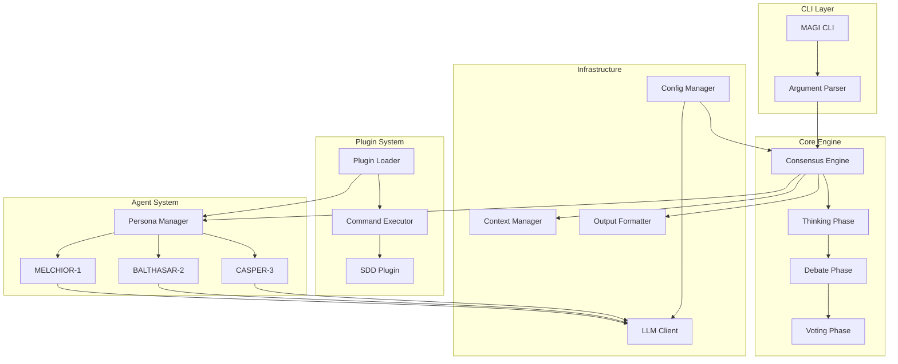

# Design Document: MAGI System

## Overview

MAGIシステムは、3つの異なる人格（MELCHIOR、BALTHASAR、CASPER）による合議プロセスを通じて、多角的で信頼性の高い判断を提供するPythonベースのCLIツールである。

本設計では、以下の主要コンポーネントを定義する：
- **CLI Layer**: ユーザーインターフェースとコマンド解析
- **Core Engine**: 合議プロトコルの実行エンジン
- **Agent System**: 3賢者のペルソナ管理
- **Plugin System**: 機能拡張のためのプラグイン機構
- **Infrastructure**: LLM API通信、設定管理、出力フォーマット

## Architecture



## Components and Interfaces

### 1. CLI Layer

#### MAGI CLI (`magi/cli/main.py`)

```python
class MagiCLI:
    """MAGIシステムのエントリーポイント"""
    
    def __init__(self, config: Config):
        self.config = config
        self.consensus_engine = ConsensusEngine(config)
        self.plugin_loader = PluginLoader()
    
    def run(self, command: str, args: List[str]) -> int:
        """コマンドを実行し、Exit Codeを返す"""
        pass
    
    def show_help(self) -> None:
        """ヘルプメッセージを表示"""
        pass
    
    def show_version(self) -> None:
        """バージョン情報を表示"""
        pass
```

#### Argument Parser (`magi/cli/parser.py`)

```python
@dataclass
class ParsedCommand:
    command: str
    args: List[str]
    options: Dict[str, Any]
    plugin: Optional[str]
    output_format: OutputFormat

class ArgumentParser:
    """コマンドライン引数の解析"""
    
    def parse(self, argv: List[str]) -> ParsedCommand:
        """引数を解析してParsedCommandを返す"""
        pass
    
    def validate(self, parsed: ParsedCommand) -> ValidationResult:
        """解析結果の妥当性を検証"""
        pass
```

### 2. Core Engine

#### Consensus Engine (`magi/core/consensus.py`)

```python
class ConsensusPhase(Enum):
    THINKING = "thinking"
    DEBATE = "debate"
    VOTING = "voting"
    COMPLETED = "completed"

@dataclass
class ConsensusResult:
    thinking_results: Dict[str, ThinkingOutput]
    debate_results: List[DebateRound]
    voting_results: Dict[str, Vote]
    final_decision: Decision
    exit_code: int

class ConsensusEngine:
    """合議プロトコルの実行エンジン"""
    
    def __init__(self, config: Config):
        self.config = config
        self.persona_manager = PersonaManager()
        self.context_manager = ContextManager()
        self.current_phase = ConsensusPhase.THINKING
    
    async def execute(self, prompt: str, plugin: Optional[Plugin] = None) -> ConsensusResult:
        """合議プロセスを実行"""
        pass
    
    async def _run_thinking_phase(self, prompt: str) -> Dict[str, ThinkingOutput]:
        """Thinking Phaseを実行"""
        pass
    
    async def _run_debate_phase(self, thinking_results: Dict[str, ThinkingOutput]) -> List[DebateRound]:
        """Debate Phaseを実行"""
        pass
    
    async def _run_voting_phase(self, context: ConsensusContext) -> Dict[str, Vote]:
        """Voting Phaseを実行"""
        pass
```

### 3. Agent System

#### Persona Manager (`magi/agents/persona.py`)

```python
class PersonaType(Enum):
    MELCHIOR = "melchior"
    BALTHASAR = "balthasar"
    CASPER = "casper"

@dataclass
class Persona:
    type: PersonaType
    name: str
    base_prompt: str
    override_prompt: Optional[str] = None
    
    @property
    def system_prompt(self) -> str:
        """基本プロンプトとオーバーライドを結合"""
        if self.override_prompt:
            return f"{self.base_prompt}\n\n{self.override_prompt}"
        return self.base_prompt

class PersonaManager:
    """3賢者のペルソナを管理"""
    
    def __init__(self):
        self.personas: Dict[PersonaType, Persona] = {}
        self._initialize_personas()
    
    def _initialize_personas(self) -> None:
        """3つのペルソナを初期化"""
        pass
    
    def apply_overrides(self, overrides: Dict[str, str]) -> None:
        """プラグインからのオーバーライドを適用"""
        pass
    
    def get_persona(self, persona_type: PersonaType) -> Persona:
        """指定されたペルソナを取得"""
        pass
```

#### Agent (`magi/agents/agent.py`)

```python
@dataclass
class ThinkingOutput:
    persona_type: PersonaType
    content: str
    timestamp: datetime

@dataclass
class DebateOutput:
    persona_type: PersonaType
    round_number: int
    responses: Dict[PersonaType, str]  # 他エージェントへの反論
    timestamp: datetime

class Vote(Enum):
    APPROVE = "approve"
    DENY = "deny"
    CONDITIONAL = "conditional"

@dataclass
class VoteOutput:
    persona_type: PersonaType
    vote: Vote
    reason: str
    conditions: Optional[List[str]] = None  # CONDITIONALの場合の条件

class Agent:
    """個別エージェントの実装"""
    
    def __init__(self, persona: Persona, llm_client: LLMClient):
        self.persona = persona
        self.llm_client = llm_client
    
    async def think(self, prompt: str) -> ThinkingOutput:
        """独立した思考を生成"""
        pass
    
    async def debate(self, others_thoughts: Dict[PersonaType, str], round_num: int) -> DebateOutput:
        """他エージェントの意見に対する反論を生成"""
        pass
    
    async def vote(self, context: str) -> VoteOutput:
        """最終投票を行う"""
        pass
```

### 4. Plugin System

#### Plugin Loader (`magi/plugins/loader.py`)

```python
@dataclass
class PluginMetadata:
    name: str
    version: str
    description: str

@dataclass
class BridgeConfig:
    command: str
    interface: str  # "stdio" | "file"
    timeout: int = 30

@dataclass
class Plugin:
    metadata: PluginMetadata
    bridge: BridgeConfig
    agent_overrides: Dict[str, str]

class PluginLoader:
    """YAMLプラグイン定義の読み込み"""
    
    def load(self, path: Path) -> Plugin:
        """YAMLファイルからプラグインを読み込む"""
        pass
    
    def validate(self, plugin_data: Dict) -> ValidationResult:
        """プラグイン定義の妥当性を検証"""
        pass
    
    def _parse_yaml(self, content: str) -> Dict:
        """YAML文字列をパース"""
        pass
```

#### Command Executor (`magi/plugins/executor.py`)

```python
@dataclass
class CommandResult:
    stdout: str
    stderr: str
    return_code: int
    execution_time: float

class CommandExecutor:
    """外部コマンドの実行"""
    
    def __init__(self, timeout: int = 30):
        self.timeout = timeout
    
    async def execute(self, command: str, args: List[str] = None) -> CommandResult:
        """コマンドを実行し結果を返す"""
        pass
    
    def _capture_output(self, process: subprocess.Popen) -> Tuple[str, str]:
        """標準出力と標準エラーをキャプチャ"""
        pass
```

### 5. Infrastructure

#### LLM Client (`magi/llm/client.py`)

```python
@dataclass
class LLMRequest:
    system_prompt: str
    user_prompt: str
    max_tokens: int = 4096
    temperature: float = 0.7

@dataclass
class LLMResponse:
    content: str
    usage: Dict[str, int]
    model: str

class LLMClient:
    """Anthropic APIクライアント"""
    
    def __init__(self, api_key: str, model: str = "claude-3-sonnet-20240229"):
        self.api_key = api_key
        self.model = model
        self.retry_count = 3
        self.timeout = 60
    
    async def send(self, request: LLMRequest) -> LLMResponse:
        """APIリクエストを送信"""
        pass
    
    async def _retry_with_backoff(self, request: LLMRequest) -> LLMResponse:
        """指数バックオフで再試行"""
        pass
```

#### Context Manager (`magi/core/context.py`)

```python
@dataclass
class ConversationEntry:
    phase: ConsensusPhase
    persona_type: PersonaType
    content: str
    timestamp: datetime

class ContextManager:
    """会話履歴の管理"""
    
    def __init__(self, max_tokens: int = 100000):
        self.history: List[ConversationEntry] = []
        self.max_tokens = max_tokens
    
    def add_entry(self, entry: ConversationEntry) -> None:
        """履歴にエントリを追加"""
        pass
    
    def get_context_for_phase(self, phase: ConsensusPhase) -> str:
        """フェーズに必要なコンテキストを取得"""
        pass
    
    def summarize_if_needed(self) -> None:
        """トークン制限に近づいた場合に要約"""
        pass
    
    def export(self) -> Dict:
        """履歴を構造化形式でエクスポート"""
        pass
```

#### Config Manager (`magi/config/manager.py`)

```python
@dataclass
class Config:
    api_key: str
    model: str = "claude-3-sonnet-20240229"
    debate_rounds: int = 1
    voting_threshold: str = "majority"  # "majority" | "unanimous"
    output_format: str = "markdown"
    timeout: int = 60
    retry_count: int = 3

class ConfigManager:
    """設定の読み込みと管理"""
    
    def __init__(self):
        self.config: Optional[Config] = None
    
    def load(self) -> Config:
        """設定ファイルと環境変数から設定を読み込む"""
        pass
    
    def _load_from_file(self, path: Path) -> Dict:
        """設定ファイルから読み込み"""
        pass
    
    def _load_from_env(self) -> Dict:
        """環境変数から読み込み"""
        pass
    
    def validate(self) -> ValidationResult:
        """設定の妥当性を検証"""
        pass
```

#### Output Formatter (`magi/output/formatter.py`)

```python
class OutputFormat(Enum):
    JSON = "json"
    MARKDOWN = "markdown"

class OutputFormatter:
    """出力フォーマットの変換"""
    
    def format(self, result: ConsensusResult, format_type: OutputFormat) -> str:
        """結果を指定形式にフォーマット"""
        pass
    
    def _to_json(self, result: ConsensusResult) -> str:
        """JSON形式に変換"""
        pass
    
    def _to_markdown(self, result: ConsensusResult) -> str:
        """Markdown形式に変換"""
        pass
```

## Data Models

### Core Data Structures

```python
# 投票結果の集計
@dataclass
class VotingTally:
    approve_count: int
    deny_count: int
    conditional_count: int
    
    def get_decision(self, threshold: str) -> Decision:
        """閾値に基づいて最終判定を決定"""
        if threshold == "unanimous":
            if self.approve_count == 3:
                return Decision.APPROVED
            elif self.deny_count >= 1:
                return Decision.DENIED
            else:
                return Decision.CONDITIONAL
        else:  # majority
            if self.approve_count >= 2:
                return Decision.APPROVED
            elif self.deny_count >= 2:
                return Decision.DENIED
            else:
                return Decision.CONDITIONAL

class Decision(Enum):
    APPROVED = "approved"
    DENIED = "denied"
    CONDITIONAL = "conditional"

# Debate Round
@dataclass
class DebateRound:
    round_number: int
    outputs: Dict[PersonaType, DebateOutput]
    timestamp: datetime
```

### Plugin Schema

```yaml
# plugin.yaml schema
plugin:
  name: string (required)
  version: string (optional, default: "1.0.0")
  description: string (required)

bridge:
  command: string (required)
  interface: string (required, enum: ["stdio", "file"])
  timeout: integer (optional, default: 30)

agent_overrides:
  melchior: string (optional)
  balthasar: string (optional)
  casper: string (optional)
```


## Correctness Properties

*A property is a characteristic or behavior that should hold true across all valid executions of a system-essentially, a formal statement about what the system should do. Properties serve as the bridge between human-readable specifications and machine-verifiable correctness guarantees.*

### Property 1: コマンド解析の正確性

*For any* コマンド文字列に対して、有効なコマンドであれば適切なハンドラーに処理が委譲され、無効なコマンドであればエラーメッセージが生成される

**Validates: Requirements 1.1, 1.2**

### Property 2: エラーメッセージ生成の一貫性

*For any* APIエラー種別に対して、LLM_Clientは対応する適切なエラーメッセージを生成する

**Validates: Requirements 2.3**

### Property 3: オーバーライド適用の保全性

*For any* プラグインのagent_overridesに対して、適用後のシステムプロンプトは基本プロンプトとオーバーライドの両方を含む

**Validates: Requirements 3.5, 8.4**

### Property 4: Thinking Phaseの独立性

*For any* Thinking Phase実行時に、各エージェントに渡されるコンテキストには他のエージェントの出力が含まれない

**Validates: Requirements 4.2**

### Property 5: フェーズ遷移の正確性

*For any* 全エージェントの思考完了後、ConsensusEngineのフェーズはTHINKINGからDEBATEに遷移する

**Validates: Requirements 4.3**

### Property 6: エージェント失敗時の継続性

*For any* エージェントの思考生成失敗時に、残りのエージェントの処理は継続され、失敗はエラーログに記録される

**Validates: Requirements 4.4**

### Property 7: Debate Phaseのコンテキスト構築

*For any* Debate Phase開始時に、各エージェントに渡されるコンテキストには他の2つのエージェントの思考結果が含まれる

**Validates: Requirements 5.1**

### Property 8: ラウンド数に基づく状態遷移

*For any* 設定されたラウンド数nに対して、n回のDebateラウンド完了後にVoting Phaseに遷移する

**Validates: Requirements 5.3**

### Property 9: 投票集計と判定の正確性

*For any* 3つのエージェントの投票組み合わせ（APPROVE/DENY/CONDITIONAL）に対して、設定された閾値（majority/unanimous）に基づいて正しい最終判定とExit Codeが決定される

**Validates: Requirements 6.2, 6.3, 6.4**

### Property 10: CONDITIONAL投票時の条件出力

*For any* CONDITIONALを含む投票結果に対して、出力には条件付き承認の詳細が含まれる

**Validates: Requirements 6.5**

### Property 11: 会話履歴のラウンドトリップ

*For any* 会話エントリを追加した後、そのエントリは履歴から取得可能であり、エクスポート時に構造化形式で出力される

**Validates: Requirements 7.1, 7.2, 7.3**

### Property 12: トークン制限の遵守

*For any* 会話履歴のサイズがトークン制限に近づいた場合、Context_Managerは履歴を要約または削除して制限内に収める

**Validates: Requirements 7.4**

### Property 13: YAMLパースとメタデータ抽出

*For any* 有効なプラグインYAML定義に対して、パースが成功しメタデータが正しく抽出される

**Validates: Requirements 8.1, 8.2**

### Property 14: 無効なYAMLのエラーハンドリング

*For any* 無効なYAML形式に対して、具体的なエラー箇所を示すエラーメッセージが生成される

**Validates: Requirements 8.3**

### Property 15: 出力フォーマット変換の正確性

*For any* ConsensusResultと出力形式（JSON/Markdown）に対して、指定形式で有効な出力が生成され、必要な情報（思考、議論、投票結果）が含まれる

**Validates: Requirements 11.1, 11.2, 11.3**

### Property 16: 設定読み込みと適用

*For any* 設定値（Debateラウンド数、投票閾値）に対して、環境変数または設定ファイルから読み込まれた値が正しくConsensus_Engineに適用される

**Validates: Requirements 12.1, 12.3, 12.4**

## Error Handling

### エラーカテゴリ

| カテゴリ | エラー種別 | 処理方針 |
|---------|-----------|---------|
| **設定エラー** | APIキー未設定 | 起動中止、明確なエラーメッセージ表示 |
| **設定エラー** | 無効な設定値 | デフォルト値にフォールバック、警告表示 |
| **APIエラー** | タイムアウト | 設定回数まで再試行、最終的に失敗報告 |
| **APIエラー** | レート制限 | 指数バックオフで再試行 |
| **APIエラー** | 認証エラー | 即座に失敗、APIキー確認を促すメッセージ |
| **プラグインエラー** | YAML解析失敗 | 具体的なエラー箇所を報告 |
| **プラグインエラー** | 外部コマンド失敗 | エラーコードと出力を報告 |
| **プラグインエラー** | コマンドタイムアウト | プロセス終了、タイムアウトエラー報告 |
| **エージェントエラー** | 思考生成失敗 | エラー記録、他エージェント継続 |

### エラーレスポンス構造

```python
@dataclass
class MagiError:
    code: str
    message: str
    details: Optional[Dict[str, Any]] = None
    recoverable: bool = False

class ErrorCode(Enum):
    CONFIG_MISSING_API_KEY = "CONFIG_001"
    CONFIG_INVALID_VALUE = "CONFIG_002"
    API_TIMEOUT = "API_001"
    API_RATE_LIMIT = "API_002"
    API_AUTH_ERROR = "API_003"
    PLUGIN_YAML_PARSE_ERROR = "PLUGIN_001"
    PLUGIN_COMMAND_FAILED = "PLUGIN_002"
    PLUGIN_COMMAND_TIMEOUT = "PLUGIN_003"
    PLUGIN_LOAD_TIMEOUT = "PLUGIN_004"
    AGENT_THINKING_FAILED = "AGENT_001"
```

## Testing Strategy

### 実行環境

- **パッケージマネージャー**: uv（uvx）
- **Python環境管理**: uv venv
- **依存関係管理**: pyproject.toml + uv.lock

### テストフレームワーク

- **ユニットテスト**: unittest（Python標準ライブラリ）
- **プロパティベーステスト**: Hypothesis
- **カバレッジ**: coverage.py

### テスト実行コマンド

```bash
# ユニットテスト実行
uv run python -m unittest discover -s tests/unit -v

# プロパティベーステスト実行
uv run python -m unittest discover -s tests/property -v

# 全テスト実行
uv run python -m unittest discover -s tests -v

# カバレッジ付きテスト実行
uv run coverage run -m unittest discover -s tests
uv run coverage report
```

### ユニットテスト

ユニットテストは以下の領域をカバーする：

1. **CLI Layer**
   - コマンド解析の正確性
   - ヘルプ・バージョン表示

2. **Core Engine**
   - フェーズ遷移ロジック
   - 投票集計ロジック

3. **Plugin System**
   - YAML解析
   - メタデータ抽出

4. **Infrastructure**
   - 設定読み込み
   - 出力フォーマット変換

### プロパティベーステスト

プロパティベーステストは、設計ドキュメントのCorrectness Propertiesセクションで定義された各プロパティを検証する。

**テスト実行設定:**
- 各プロパティテストは最低100回のイテレーションを実行
- 各テストは対応するプロパティ番号をコメントで明記

**テストアノテーション形式:**
```python
# **Feature: magi-core, Property 1: コマンド解析の正確性**
# **Validates: Requirements 1.1, 1.2**
class TestCommandParsing(unittest.TestCase):
    @given(command=st.text())
    @settings(max_examples=100)
    def test_command_parsing_accuracy(self, command):
        ...
```

**プロパティテスト対象:**

| Property | テスト内容 | ジェネレータ |
|----------|-----------|-------------|
| Property 1 | コマンド解析 | 任意の文字列 |
| Property 2 | エラーメッセージ生成 | APIエラー種別 |
| Property 3 | オーバーライド適用 | プラグイン定義 |
| Property 4 | Thinking Phase独立性 | プロンプト文字列 |
| Property 5 | フェーズ遷移 | 思考結果セット |
| Property 6 | エージェント失敗継続 | 失敗パターン |
| Property 7 | Debateコンテキスト | 思考結果セット |
| Property 8 | ラウンド数遷移 | ラウンド数（1-10） |
| Property 9 | 投票集計 | 投票組み合わせ |
| Property 10 | CONDITIONAL出力 | CONDITIONAL投票 |
| Property 11 | 履歴ラウンドトリップ | 会話エントリ |
| Property 12 | トークン制限 | 大量履歴データ |
| Property 13 | YAMLパース | 有効なYAML |
| Property 14 | 無効YAMLエラー | 無効なYAML |
| Property 15 | 出力フォーマット | ConsensusResult |
| Property 16 | 設定適用 | 設定値セット |

### テストディレクトリ構造

```
tests/
├── unit/
│   ├── __init__.py
│   ├── test_cli.py
│   ├── test_consensus.py
│   ├── test_persona.py
│   ├── test_plugin.py
│   ├── test_context.py
│   ├── test_config.py
│   └── test_output.py
├── property/
│   ├── __init__.py
│   ├── test_command_parsing.py
│   ├── test_consensus_protocol.py
│   ├── test_plugin_loading.py
│   ├── test_context_management.py
│   └── test_output_formatting.py
└── __init__.py
```
