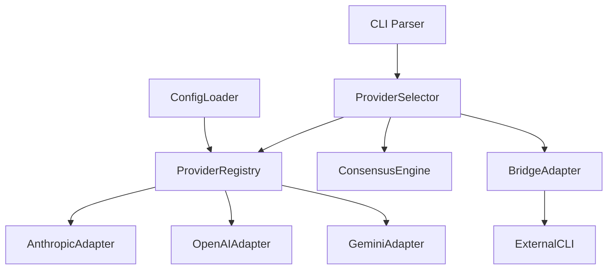
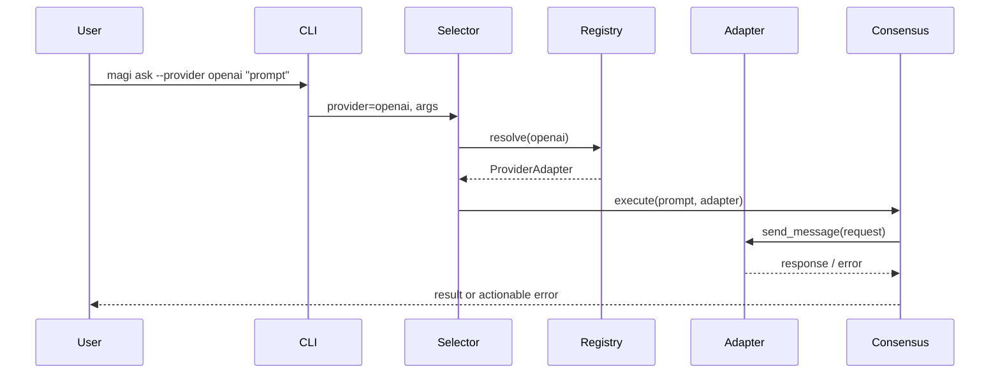
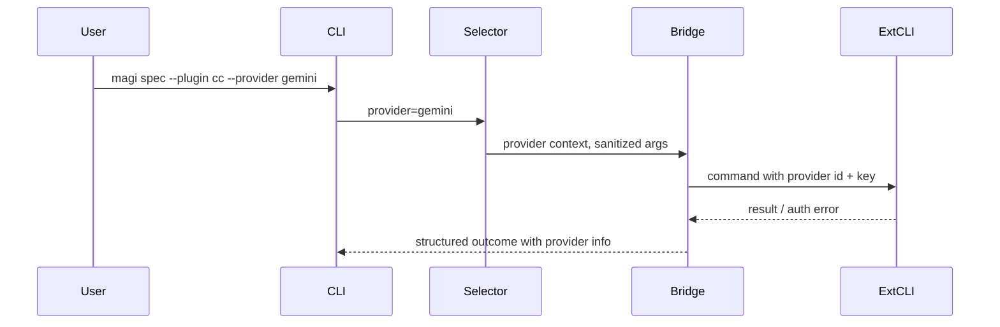

# Design Document

## Overview 
本機能は MAGI CLI が複数プロバイダ（Anthropic/OpenAI/Gemini 等）の API キーと CLI ブリッジを安全に選択・連携できるようにし、既存の合議パイプラインに統合する。対象ユーザーは MAGI CLI オペレーターであり、プロバイダ切替と鍵管理を明示的に制御しながら既存の ask/spec ワークフローを利用できるようにする。これにより、単一プロバイダ依存を解消し、運用柔軟性とフェイルセーフ性を強化する。

### Goals
- プロバイダ別の鍵/モデル/エンドポイント設定をロードし、安全に選択・伝搬できること。
- CLI/合議パイプライン/外部 CLI ブリッジで一貫したプロバイダコンテキストを扱うこと。
- 鍵欠落・認証失敗・非対応プロバイダを早期に検知し、監査可能なエラーを返すこと。

### Non-Goals
- 各プロバイダの課金最適化や高負荷チューニング（将来対応）。
- プラグイン YAML スキーマの大規模拡張（最小限の provider 受け渡しに留める）。
- 合議ロジック（Thinking/Debate/Voting）の挙動変更。

## Architecture

### Existing Architecture Analysis
- 現状の LLMClient は Anthropic 固定実装で抽象化がない。
- ConfigManager は `MAGI_API_KEY` のみを受け付け、プロバイダ別設定を持たない。
- CLI パーサーはプロバイダ指定オプションを持たず、プラグイン/CLI ブリッジへの provider 伝搬経路がない。
- Guardrails/SecurityFilter/イベント記録は存在するが、プロバイダ文脈は記録していない。

### Architecture Pattern & Boundary Map
選択パターン: Adapter Registry（プロバイダごとのアダプタとレジストリで解決し、セレクタがコンテキストを渡す）。責務境界は CLI/Config（入力）、ProviderSelector/Registry（選択・検証）、ProviderAdapters（外部通信）、ConsensusEngine（合議）、PluginBridgeAdapter（外部 CLI 呼び出し）に分離する。



### Technology Stack

| Layer | Choice / Version | Role in Feature | Notes |
|-------|------------------|-----------------|-------|
| CLI | argparse ベース (既存) | provider フラグ解析とバリデーション | 新オプション追加 |
| Config | yaml + env (既存 ConfigManager) | プロバイダ別設定/鍵ロード | ENV/ファイル両対応 |
| LLM Provider | 新規 ProviderAdapter インターフェース + Anthropic/OpenAI/Gemini 実装 | LLM 呼び出しとエラー正規化 | 既存 AsyncAnthropic をラップ |
| Core | ConsensusEngine | セレクタ経由の LLMClient 差し替え | 合議ロジックは変更なし |
| Plugins/CLI Bridge | PluginGuard/Executor + BridgeAdapter | 外部 CLI 呼び出し時の provider 伝搬とメタ文字防御 | プロバイダ未対応を fail-fast |
| Security | SecurityFilter / Guardrails | プロンプト前検査、鍵非ログ | イベントに provider 情報を追加 |

## System Flows

### Provider 切替シーケンス


### プラグイン/外部 CLI ブリッジシーケンス


## Requirements Traceability

| Requirement | Summary | Components | Interfaces | Flows |
|-------------|---------|------------|------------|-------|
| 1.1 | プロバイダ別キーを環境/設定から取得 | ConfigLoader, ProviderRegistry | Config schema | Provider 切替 |
| 1.2 | 複数キーから選択、非選択は無視 | ProviderSelector, ProviderRegistry | Selector API | Provider 切替 |
| 1.3 | 必須キー欠落で明示エラー | ProviderSelector | Error contract | Provider 切替 |
| 1.4 | キャッシュ中もログへ鍵出力禁止 | ProviderSelector, EventEmitter | Logging policy | Provider 切替 |
| 1.5 | ランタイムで鍵ローテーション | ConfigLoader | Reload API | Provider 切替 |
| 2.1 | プロバイダフラグでルーティング | CLI Parser, ProviderSelector | CLI options | Provider 切替 |
| 2.2 | 未サポート時に事前中断 | ProviderSelector | Validation | Provider 切替 |
| 2.3 | 呼び出し間で設定分離 | ProviderRegistry | Registry contract | Provider 切替 |
| 2.4 | プロバイダ特有パラメータ検証 | ProviderRegistry | Adapter capability contract | Provider 切替 |
| 2.5 | 未指定時のデフォルトを明示 | CLI Parser, ProviderSelector | CLI output | Provider 切替 |
| 3.1 | 外部 CLI に選択鍵のみ伝搬 | BridgeAdapter | Bridge contract | ブリッジ |
| 3.2 | 認証エラーの文脈提示 | BridgeAdapter | Error contract | ブリッジ |
| 3.3 | メタ文字検証 | PluginGuard | Guard contract | ブリッジ |
| 3.4 | 複数プロバイダ対応ブリッジで ID 送出 | BridgeAdapter | Bridge contract | ブリッジ |
| 3.5 | 未対応ブリッジは fail-fast | BridgeAdapter | Validation | ブリッジ |
| 4.1 | 鍵取得/選択エラーの監査イベント | EventEmitter | Event schema | Provider 切替 |
| 4.2 | 認証失敗で再試行停止 | ProviderAdapter | Error policy | Provider 切替 |
| 4.3 | Guardrails/SecurityFilter 前に鍵検証 | ProviderSelector | Validation | Provider 切替 |
| 4.4 | 複数プロバイダのヘルスチェック | ProviderAdapter | Health API | Provider 切替 |
| 4.5 | 部分的設定欠落でブロック | ProviderSelector | Validation | Provider 切替 |

## Components and Interfaces

### Summary Table
| Component | Domain/Layer | Intent | Req Coverage | Key Dependencies (P0/P1) | Contracts |
|-----------|--------------|--------|--------------|--------------------------|-----------|
| ProviderConfigLoader | Config | プロバイダ別キー/モデル/エンドポイントを env+yaml からロードし正規化 | 1.1,1.5,2.4 | ConfigManager(P0) | Service |
| ProviderRegistry | Core | 利用可能な ProviderAdapter を登録・解決し、必須パラメータを検証 | 1.2,2.2,2.3,2.4 | ProviderConfigLoader(P0) | Service |
| ProviderSelector | Core | CLI/Config から選択された provider を検証し、合議/ブリッジへコンテキストを配布 | 1.3,1.4,2.1,2.5,4.3 | Registry(P0), CLI Parser(P0), EventEmitter(P1) | Service |
| ProviderAdapter (Anthropic/OpenAI/Gemini) | LLM Adapter | 共通インターフェースで LLM 呼び出し・エラー正規化・ヘルスチェックを行う | 1.2,2.4,4.2,4.4 | HTTP/SDK(P1), TokenBudget(P2) | Service |
| BridgeAdapter | Plugins/CLI | 外部 CLI へ provider ID と鍵を安全に渡し、認証エラーを文脈付きで返す | 3.1,3.2,3.4,3.5 | PluginGuard(P0), Executor(P0) | Service |
| AuditEventEmitter (拡張) | Core | プロバイダ文脈付きのイベント/ログを出力し、鍵をマスク | 1.4,4.1,4.5 | Consensus events(P0), Logging(P1) | State |

### Core / Config

#### ProviderConfigLoader
| Field | Detail |
|-------|--------|
| Intent | プロバイダ別設定をロードし、必須フィールドをバリデート |
| Requirements | 1.1,1.5,2.4 |

**Responsibilities & Constraints**
- env 優先で yaml を上書きし、キー/モデル/エンドポイントをマージ。
- 不足フィールドはバリデーションで検出し、ProviderSelector へエラー情報を渡す。
- 鍵はプロセスメモリ内に限定し、ログへ出さない。

**Dependencies**
- Inbound: ConfigManager — 設定取得 (P0)
- Outbound: ProviderRegistry — 設定提供 (P0)

**Contracts**: Service [x] / API [ ] / Event [ ] / Batch [ ] / State [ ]

##### Service Interface
```typescript
interface ProviderConfigLoader {
  load(): Result<ProviderConfigMap, ConfigError>;
  reload(): Result<ProviderConfigMap, ConfigError>;
}
```
- Preconditions: 読み取り可能な env/yaml が存在。
- Postconditions: 各 provider に必須フィールドが存在し、欠落はエラー集合として返す。

**Implementation Notes**
- Integration: ConfigManager の ENV_MAPPING を拡張し、provider.* 名前空間で読み込む。
- Validation: 必須フィールド (api_key, model/defaults, endpoint optional) をチェック。
- Risks: フィールド不足時のエラー伝搬漏れ。

#### ProviderRegistry
| Field | Detail |
|-------|--------|
| Intent | ProviderAdapter の登録と能力/必須パラメータ検証 |
| Requirements | 1.2,2.2,2.3,2.4 |

**Responsibilities & Constraints**
- サポートプロバイダ一覧を保持し、未登録 provider 要求を拒否。
- プロバイダ固有の必須パラメータ（例: model, endpoint）を検証。
- 各 adapter の capability メタデータを公開（ヘルスチェック可否など）。

**Dependencies**
- Inbound: ProviderConfigLoader (P0), ProviderSelector (P0)
- Outbound: ProviderAdapter 実装群 (P0)

**Contracts**: Service [x] / API [ ] / Event [ ] / Batch [ ] / State [ ]

##### Service Interface
```typescript
interface ProviderRegistry {
  list(): ProviderId[];
  resolve(id: ProviderId): Result<ProviderAdapter, ProviderError>;
  capabilities(id: ProviderId): ProviderCapabilities;
}
```
- Preconditions: ロード済み設定が存在。
- Postconditions: 未登録 id はエラー、登録済みは adapter を返却。

**Implementation Notes**
- Integration: インメモリ登録、設定リロードで再構築。
- Validation: 不足パラメータを ProviderError として返却。
- Risks: 登録漏れによるデフォルトフォールバック。テストで防ぐ。

### LLM Adapter

#### ProviderAdapter (抽象)
| Field | Detail |
|-------|--------|
| Intent | LLM 呼び出しの共通契約とエラー正規化 |
| Requirements | 1.2,2.4,4.2,4.4 |

**Responsibilities & Constraints**
- メッセージ送信、エラー分類（認証/レート/未知）、ヘルスチェックを統一インターフェースで提供。
- 鍵・エンドポイント・モデルを内部で保持し、外部へ漏らさない。

**Dependencies**
- Outbound: 各 SDK/HTTP クライアント (P1)

**Contracts**: Service [x] / API [ ] / Event [ ] / Batch [ ] / State [ ]

##### Service Interface
```typescript
interface ProviderAdapter {
  send(request: ProviderRequest): Result<LLMResponse, ProviderError>;
  health(): Result<HealthStatus, ProviderError>;
  id(): ProviderId;
}
```
- Preconditions: 必須キー/モデルが設定済み。
- Postconditions: 認証失敗時は再試行しないエラー種別を返す。

**Implementation Notes**
- Integration: 既存 AsyncAnthropic ラッパーを AnthropicAdapter として利用。OpenAI/Gemini は HTTP/SDK をラップする構造に合わせる。
- Validation: request 生成時に max_tokens/temperature の基本チェック。
- Risks: SDK 差分による例外漏れ。例外を ProviderError に正規化。

### CLI / Plugins

#### CLI Parser 拡張
| Field | Detail |
|-------|--------|
| Intent | `--provider` フラグを解析しデフォルトを明示 |
| Requirements | 2.1,2.5 |

**Responsibilities & Constraints**
- 未指定時はデフォルト provider（config 既定値）を選択し、出力に明示。
- 未知の provider 値はエラーとして返す。

**Dependencies**
- Outbound: ProviderSelector (P0)

**Contracts**: Service [x] / API [ ] / Event [ ] / Batch [ ] / State [ ]

**Implementation Notes**
- Validation: VALID_COMMANDS に影響なし。options に provider を格納。
- デフォルト解決順: `--provider` > config (yaml) > env > built-in 既定値（Anthropic を維持）。選択した provider をコマンド出力に明示する。
- 未設定/不明値は actionable なメッセージで失敗させる（Req 1.3/4.5 と整合）。
- Risks: フラグ欠落時のデフォルト不一致。Config 既定値と同期。

#### BridgeAdapter
| Field | Detail |
|-------|--------|
| Intent | 外部 CLI への provider ID と鍵の最小伝搬とガード |
| Requirements | 3.1,3.2,3.4,3.5 |

**Responsibilities & Constraints**
- ProviderSelector から受けた鍵を安全に子プロセスへ渡す（env または stdin）。ログへ鍵を出さない。
- PluginGuard によるメタ文字検証後に実行。未対応プロバイダは即エラー。
- 認証失敗を provider 文脈付きで返す。

**Dependencies**
- Inbound: ProviderSelector (P0)
- Outbound: PluginGuard(P0), Executor(P0)

**Contracts**: Service [x] / API [ ] / Event [ ] / Batch [ ] / State [ ]

##### Service Interface
```typescript
interface BridgeAdapter {
  invoke(command: str, provider: ProviderContext, args: list[str]): BridgeResult;
}
```
- Preconditions: provider がサポートされるブリッジであること。
- Postconditions: 認証エラー時に provider 名と再設定手順を返す。

**Implementation Notes**
- Integration: Executor 呼び出し前に PluginGuard.validate で再検証。
- Validation: 対応プロバイダ一覧をブリッジごとに保持。
- Risks: 鍵の環境変数渡しによるリーク。子プロセス終了後にクリア。

### Observability / Security

#### AuditEventEmitter 拡張
| Field | Detail |
|-------|--------|
| Intent | provider 情報付きのイベントを記録しつつ鍵をマスク |
| Requirements | 1.4,4.1,4.5 |

**Responsibilities & Constraints**
- イベント payload に provider id / error type / missing_fields を含める。
- 鍵はマスクまたは非記録。SecurityFilter との整合を保つ。

**Dependencies**
- Inbound: ProviderSelector, ProviderAdapter | Outbound: Logger

**Contracts**: State [x] / Service [ ] / API [ ] / Event [ ] / Batch [ ]

**Implementation Notes**
- Integration: consensus._record_event に provider/missing_fields/auth_error を任意フィールドとして追加し、既存イベント利用者への後方互換を維持。ログレベルは既存ポリシーに従う。
- Risks: 既存イベントスキーマ変更による互換性。フィールド追加は後方互換性を保つ。

## Data Models

### Domain Model
- ProviderId: `anthropic|openai|gemini|custom...` を列挙で管理。
- ProviderConfig: `{ api_key: str, model: str, endpoint?: str, options?: dict }`
- ProviderContext: `{ id: ProviderId, config: ProviderConfig }`

### Logical Data Model
- ProviderConfigMap: `Dict[ProviderId, ProviderConfig]` を ConfigLoader が返却。
- Registry maintains in-memory map; no persistent storage変更なし。

### Data Contracts & Integration
- Bridge invocation payload: `{ provider: ProviderId, token: masked/obfuscated env var name, args: list[str] }`
- Event schema追加フィールド: `provider`, `missing_fields`, `auth_error`.

## Error Handling

### Error Strategy
- Missing key / unsupported provider: fail-fast at ProviderSelector with actionable message (Req 1.3, 2.2, 4.5).
- Auth failure from provider: ProviderAdapter returns non-retriable error and stops retries (Req 4.2).
- Bridge auth error: BridgeAdapter wraps stderr with provider context (Req 3.2).
- Config reload failure: surfaces as ConfigError; existing behavior unchanged except provider detail追加。

### Error Categories and Responses
- User errors: 不明 provider / 欠落キー / 不足パラメータ → CLI でメッセージ表示、再設定案内。
- System errors: SDK/HTTP 障害 → 再試行ポリシー（既存リトライ）を尊重しつつ provider 明示。
- Security errors: メタ文字/未対応ブリッジ → 即時拒否、イベントに provider を付与。

### Monitoring
- イベントに provider 情報を追加し、Guardrails/SecurityFilter イベントと合わせてダッシュボード化を想定。追加フィールドは任意で後方互換を確保。
- ヘルスチェックは非課金経路を優先し、プロバイダ別デフォルトを定義：OpenAI は `/v1/models`、Gemini/Anthropic は非課金エンドポイントが不明な場合はスキップまたはオプトイン警告とする。課金が必要な経路はデフォルト無効で、オプトイン設定が必要。

## Testing Strategy
- Unit: ProviderRegistry.resolve バリデーション（未知 provider、必須フィールド不足）、ProviderSelector のデフォルト選択とエラー経路、CLI パーサーの `--provider`。
- Integration: ConsensusEngine 経由で provider 切替を行い、AnthropicAdapter/OpenAIAdapter/GeminiAdapter をモックしてルーティング確認。BridgeAdapter が PluginGuard/Executor と連携し未対応時に fail-fast。
- E2E (CLI): `magi ask --provider openai` が適切なエラーメッセージや provider 明示を出すこと。
- Performance: ProviderRegistry/Selector はインメモリでオーバーヘッドが小さいため軽微。ヘルスチェックは非課金経路で実施。

## Security Considerations
- 鍵はログ・イベントに記録しない。子プロセスへは環境変数 or stdin のみに限定し、終了後にクリア。
- PluginGuard によるメタ文字検証を必須経路に保持。未対応ブリッジは起動前に拒否。
- Guardrails/SecurityFilter 前段で provider 選択と鍵存在を確認し、意図しないプロンプト送出を防ぐ。

## Performance & Scalability
- レジストリ/セレクタは軽量。LLM アダプタのリトライポリシーは既存に倣い、プロバイダごとのレート制限に合わせる。
- ヘルスチェックは低頻度/非課金で実行し、結果をキャッシュして不要な呼び出しを避ける。

## Migration Strategy
- フィーチャーフラグまたは config トグルで provider 選択機能を段階導入。
- デフォルト provider は既存と同じ Anthropic とし、設定欠落時は従来と同等のエラーを返す。
- 新オプション/設定がない環境でも後方互換（provider 未指定はデフォルト）。
