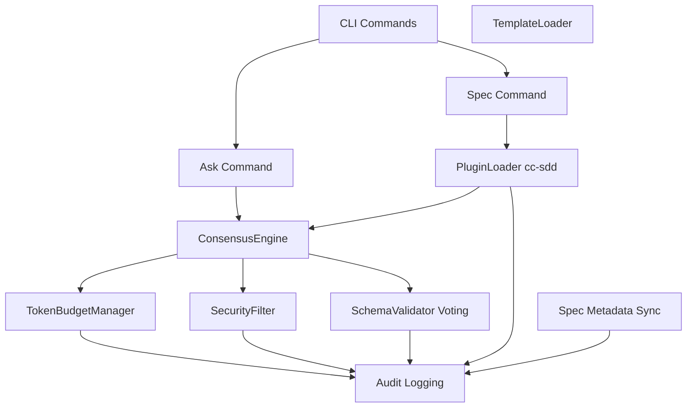
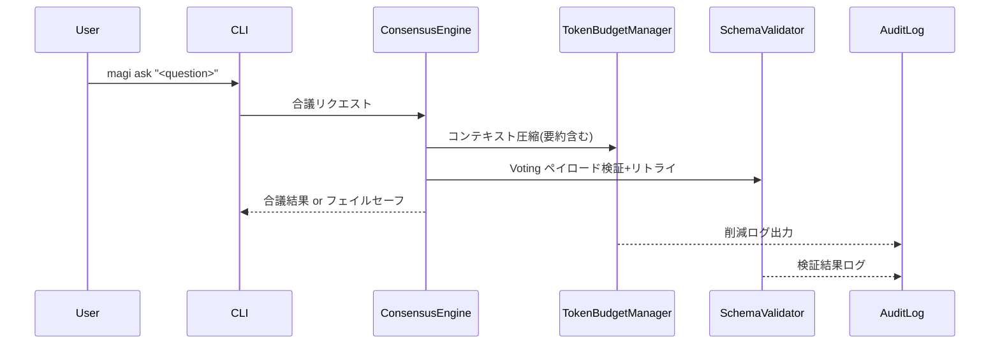
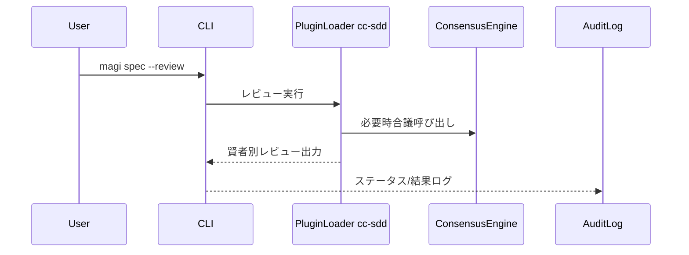
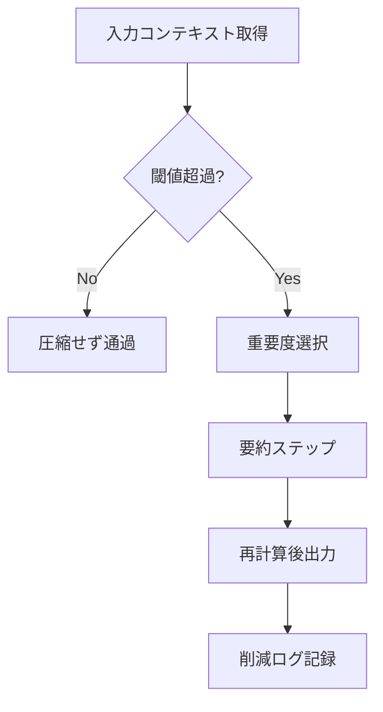
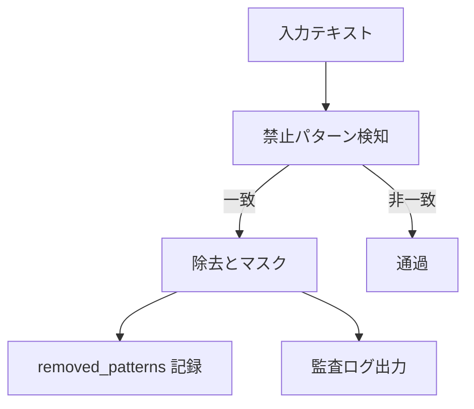
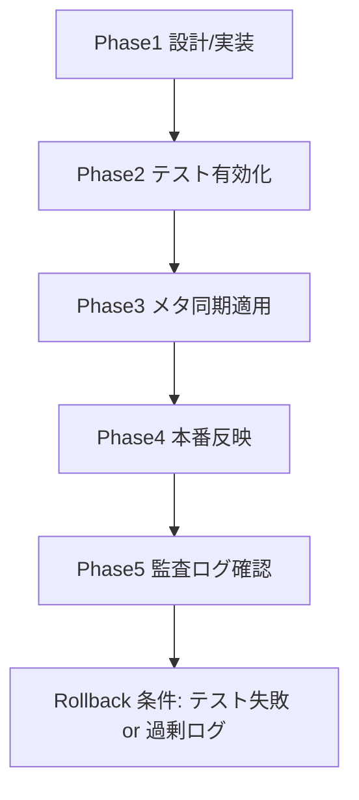

# Technical Design Document

## Overview
本機能は、`magi` CLI における未実装・不整合を解消し、合議結果提示、レビュー統合、サニタイズ監査、投票検証フェイルセーフ、トークン圧縮精度、メタデータ整合、テスト健全性を回復させる。利用者は `magi ask` で安定した合議結果を取得し、`magi spec` で 3 賢者レビューを確認できる。セキュリティ担当は禁止パターン除去の監査ログを確認でき、運用者はトークン圧縮と投票検証のフェイルセーフ履歴を追跡できる。

### Goals
- `magi ask` を合議エンジンに統合し、フェイルセーフを含む結果表示を実現する。
- `magi spec` に 3 賢者レビュー出力と進行ステータス表示を統合する。
- サニタイズ・投票検証・トークン圧縮で監査可能なログを残し、メタデータとテストの整合を回復する。

### Non-Goals
- 新規 UI/GUI の追加は行わない。
- 新しい LLM モデル選定や推論パイプラインの刷新は範囲外。
- プロダクション運用の監視基盤構築は対象外（ログは既存チャネルへ出力）。

## Architecture

### Existing Architecture Analysis
- CLI → ConsensusEngine（Thinking/Debate/Voting）→ Output/Plugins のレイヤード構造を維持する。
- TokenBudgetManager、TemplateLoader、SchemaValidator、QuorumManager、SecurityFilter/PluginGuard がハードニングを担う。
- unittest ベースのテスト構成（unit/property/integration）を踏襲し、プラグインローダー property テストを再有効化する。

### High-Level Architecture


### Architecture Integration
- 既存パターン保持: CLI エントリーポイントと ConsensusEngine の責務分離を維持。
- 新規要素: Voting 用 jsonschema 検証とリトライ、サニタイズ監査ログ、要約付き圧縮ログ、メタ同期処理を追加。
- 技術整合: Python 3.11、既存 logging 設定を継続利用。Voting ペイロード検証に jsonschema を必須依存として採用し、未導入の場合は requirements/pyproject に追加して明示的に参照する。
- Steering 準拠: Core/Plugin 分離とハードニング指針（token budget, schema validation, logging）に合致。

### Technology Alignment
- 新規外部依存は原則追加しない。ただし Voting ペイロード検証のため `jsonschema` を必須とし、未導入の場合は依存リストに追加しインストールする（実装で必ず利用する）。
- ロギングは既存 logger と監査用出力先（ファイル/STDERR）を再利用。
- CLI フローは argparse ベースの既存構造に統合し、新規コマンド追加は行わない。

### Key Design Decisions
- **Decision**: Voting ペイロードを jsonschema で検証し、最大3回（例: maxRetries=3、指数/固定バックオフ設定）リトライ後に FailSafeResponse を返す。
  - **Alternatives**: 手書き検証のみ / 例外即フェイル / リトライなし。
  - **Rationale**: 構造保証と再生成で安定性を確保しつつ、過剰リトライを防ぐ。
  - **Trade-offs**: スキーマ管理と最大3回の再試行コストが増えるが、整合性と監査性を向上。3回失敗時は即 FailSafeResponse を返し、retry_count を監査ログに残す。
- **Decision**: TokenBudgetManager に要約ステップを追加し、入力が1000トークンを超過した場合のみ要約を発火させ、削減ログにサイズ前後・保持率・要約有無・strategy を記録する。
  - **Alternatives**: 重要度選択のみ / 全面要約のみ。
  - **Rationale**: 精度と監査性の両立。重要度抽出後に要約で情報損失を抑制。
  - **Trade-offs**: 追加計算コストとログ肥大の可能性。要約トリガは1000トークン超過時のみとし、削減ログは日次ローテーション・14日保持で size_before/after と summary_applied を記録し運用閾値を明確化。
- **Decision**: SecurityFilter で禁止パターン除去時に `removed_patterns` と監査ログへマスク済み断片（1 断片最大50文字）を記録し、マスク内容で出力する。
  - **Alternatives**: 件数のみ記録 / ログなし。
  - **Rationale**: 追跡性と再発防止の根拠確保。
  - **Trade-offs**: ログ量増加とマスク実装コスト。断片マスクは最大50文字で統一し、監査ログは日次ローテーション・14日保持で過剰情報を抑制する。

## System Flows

### `magi ask` 合議実行フロー


### `magi spec` レビュー統合フロー


### トークン圧縮と監査ログ


### SecurityFilter 監査


## Requirements Traceability

| Requirement | 概要 | 主担当コンポーネント | 補助コンポーネント | フロー |
|-------------|------|----------------------|--------------------|--------|
| R1 | magi ask 合議実行と結果提示 | CLI Ask, ConsensusEngine | TokenBudgetManager, SchemaValidator, Logging | 合議実行フロー |
| R2 | magi spec レビュー統合表示 | CLI Spec, PluginLoader cc-sdd | ConsensusEngine, Logging | レビュー統合フロー |
| R3 | 禁止パターン監査ログ | SecurityFilter | Logging | SecurityFilter 監査 |
| R4 | Voting スキーマ検証+リトライ | SchemaValidator | ConsensusEngine, Logging | 合議実行フロー |
| R5 | 要約付きトークン圧縮と精緻ログ | TokenBudgetManager | Logging | 圧縮フロー |
| R6 | メタ整合・property テスト復活 | Spec Metadata Sync, PluginLoader Tests | Logging, CI | 変更なし（運用手順） |


## Components and Interfaces

### CLI Layer
#### AskCommand
- **Responsibility**: ユーザ入力を受け、ConsensusEngine を起動し結果を表示。
- **Dependencies**: ConsensusEngine, Logging, TokenBudgetManager（間接）。
- **Service Interface (Python 型イメージ)**:
```python
def run_ask(question: str, ctx: AskContext) -> AskResult:
    ...
```
- **Preconditions**: 質問文字列が空でないこと。
- **Postconditions**: 合議結果またはフェイルセーフを表示し、監査ログを残す。

#### SpecCommand
- **Responsibility**: cc-sdd プラグインを呼び出し、賢者レビューとステータスを表示。
- **Dependencies**: PluginLoader, ConsensusEngine（必要時）, Logging.
```python
def run_spec_review(target: str, ctx: SpecContext) -> SpecReviewResult:
    ...
```
- **Preconditions**: 対象仕様のパス/名前が有効。
- **Postconditions**: 賢者別レビューと進行ステータスを出力しログに記録。

### ConsensusEngine
- **Responsibility**: Thinking/Debate/Voting を統括し、トークン圧縮と検証を組み合わせる。
- **Inbound**: CLI Commands, PluginLoader.
- **Outbound**: TokenBudgetManager, SchemaValidator, Logging.
- **Integration Strategy**: 既存フローを拡張し、圧縮後に要約、Voting 前にスキーマ検証とリトライを挿入。
- **Error/Retry Handling**: Voting スキーマ検証のリトライ制御（maxRetries、backoff）は SchemaValidator 内に閉じ、ConsensusEngine は検証済みペイロードのみを消費。SchemaValidator から例外や失敗が伝播した場合は FailSafeResponse を生成して CLI/PluginLoader に返却する。
- **FailSafeResponse 形式**: `{ "status": "fail_safe", "reason": str, "fallback": str, "retry_count": int }`（reason/fallback は監査ログ用にマスク済み）。

### TokenBudgetManager
- **Responsibility**: 重要度選択＋要約でトークン削減し、削減ログを生成。
- **Outbound**: Logging.
- **Contract**:
```python
def reduce_with_summary(chunks: list[ContextChunk], budget: TokenBudget) -> ReductionResult:
    ...
```
- **Postconditions**: 削減前後サイズ、保持率、要約有無を含む ReductionLogEntry を返す。

### SchemaValidator (Voting)
- **Responsibility**: Voting ペイロードを jsonschema で検証し、リトライを制御。
- **Outbound**: Logging.
- **Contract**:
```python
def validate_voting_payload(payload: dict, schema: dict, retry: int) -> ValidationOutcome:
    ...
```
- **Postconditions**: 成功時は正当化済みペイロード、失敗時はフェイルセーフフラグと理由。
- **Error/Retry Ownership**: maxRetries と backoff はコンフィグ可能とし、バリデータ内で retry カウント・エラー理由を管理して ValidationOutcome に格納する。3 回超過時は FailSafeResponse を返却する。

### SecurityFilter
- **Responsibility**: 禁止パターン検知・除去、`removed_patterns` 記録、監査ログ出力。
- **Inbound**: ConsensusEngine 入出力、PluginGuard。
- **Outbound**: Logging.
- **Contract**:
```python
def sanitize(text: str) -> SanitizedResult:
    ...
```
- **Postconditions**: マスク済み除去断片とパターン ID を監査ログへ出力。
- **Return/Consumption**: `SanitizedResult` = `{ "sanitized_text": str, "original_id": str, "redaction_map": dict[str, str], "metadata": dict[str, str] }` を返す。ConsensusEngine は sanitized_text を下流処理へ渡し、redaction_map を監査ログと FailSafeResponse の理由整形に利用し、metadata で処理時刻・使用パターンを保持する。

### PluginLoader / cc-sdd Integration
- **Responsibility**: 3 賢者レビューの実行と集約表示。property テストを有効化し CI で検証。
- **Integration**: 既存 plugin 実行パスを維持し、戻り値フォーマットを CLI で整形表示。

### Spec Metadata Sync
- **Responsibility**: `.kiro/specs/magi-core/spec.json` の remaining_tasks を tasks.md と同期。
- **Contract**:
```python
def sync_spec_metadata(tasks: TasksStatus) -> SpecMetaUpdate:
    ...
```
- **Postconditions**: メタデータ整合、監査ログへの記録。
- **Input/Output**: `TasksStatus` = `{ "total_tasks": int, "completed_tasks": int, "in_progress_count": int, "last_updated": str }` を tasks.md から読み取り、`SpecMetaUpdate` = `{ "remaining_tasks": int, "last_synced_at": str, "source": str, "status_summary": str }` を spec.json に書き戻す。エラー/再試行は sync 処理内で保持し、ConsensusEngine は結果のみを受け取る。

### Logging/Audit
- **Responsibility**: 合議、サニタイズ、検証、圧縮、メタ同期の監査ログを統一フォーマットで出力。
- **Format**: timestamp, stage, result, details(masked), counts, size_before/after, retry_count, failure_reason.

## Data Models
- **VotingPayload (jsonschema)**:
```json
{
  "voter": "mage-1",
  "proposal": "consensus-answer",
  "justification": "理由テキスト",
  "score": 0.85,
  "confidence": 0.72
}
```
  - `voter`/`proposal`/`justification`: 非空文字列、UTF-8。
  - `score`/`confidence`: float 範囲 0.0〜1.0（例: 0.85、0.72）。
- **ValidationOutcome**:
```json
{ "ok": false, "errors": ["Missing voter field", "Score out of range"], "retries": 2, "fail_safe": true }
```
  - `errors`: 検証エラー文字列配列（例: "Missing voter field"）。
  - `retries`: int >= 0（最大3想定）、`fail_safe`: bool。
- **FailSafeResponse**:
```json
{ "status": "fail_safe", "reason": "schema_validation_failed", "fallback": "use_previous_answer", "retry_count": 3 }
```
- **ReductionLogEntry**:
```json
{ "size_before": 2400, "size_after": 900, "retain_ratio": 0.375, "summary_applied": true, "strategy": "with_summary" }
```
  - `strategy`: enum ["priority_selection_only", "with_summary"]。
- **SanitizationLogEntry**:
```json
{ "pattern_id": "regex://api-key", "count": 2, "masked_snippet": "[MASKED:UUID]-xxxx" }
```
  - `masked_snippet`: "[MASKED:UUID]" 形式でマスクを明示。
- **SanitizedResult**:
```json
{ "sanitized_text": "masked content", "original_id": "ctx-123", "redaction_map": { "regex://api-key": "[MASKED:UUID]" }, "metadata": { "processed_at": "2025-12-10T12:00:00Z" } }
```
- **TasksStatus**:
```json
{ "total_tasks": 10, "completed_tasks": 6, "in_progress_count": 3, "last_updated": "2025-12-10T09:00:00Z" }
```
  - 各カウントは 0 以上の整数、last_updated は ISO8601 文字列。
- **SpecMetaUpdate**:
```json
{ "remaining_tasks": 4, "last_synced_at": "2025-12-10T09:05:00Z", "source": "tasks.md", "status_summary": "in_progress" }
```
  - `source`: enum ["tasks.md", "manual_sync"]、`last_synced_at`: ISO8601 文字列、`status_summary`: 例 "in_progress"/"done"/"blocked"。

## Error Handling
- **User Errors (CLI)**: 無効引数・対象なし → 400 系相当でメッセージ表示。
- **Business Errors**: スキーマ検証失敗、クオーラム未達 → フェイルセーフ応答と理由表示、ログ記録。
- **System Errors**: LLM/API 障害、IO 障害 → リトライ後にフェイルセーフ、スタックはログのみ。
- **Logging**: 失敗段階・理由・リトライ回数を監査ログに残し、CLI は簡潔な要約のみ表示。

## Testing Strategy
- **Unit**:
  - TokenBudgetManager: 要約あり/なしの削減率計算。
  - SecurityFilter: 禁止パターン検知と `removed_patterns` 記録。
  - SchemaValidator: スキーマ成功/失敗/リトライ上限の分岐。
  - CLI Ask: 成功・フェイルセーフの出力整形。
- **Integration**:
  - `magi ask` フローで合議→圧縮→検証→結果表示。
  - `magi spec --review` で cc-sdd プラグイン出力集約。
  - Logging 出力フォーマットとマスク確認。
- **Property**:
  - PluginLoader property テストを有効化し、プラグイン登録・実行が総称的入力で失敗しないこと。
- **E2E (optional)**:
  - 環境変数設定下での CLI 実行パス確認。

## Security Considerations
- サニタイズ: 禁止パターン除去時にマスクを徹底し、生データ漏洩を防止。
- ログ: 機微情報を含む場合は省略/マスクし、出力先を設定可能にする。
- フェイルセーフ: 検証失敗時は安全側応答を返し、再試行回数を制限。

## Performance & Scalability
- トークン圧縮の要約は閾値超過時のみ実施し、コストを抑制。
- リトライ回数とコンテキスト要約有無を設定化し、負荷と品質を調整。
- ログ量増加に備え、ログレベル/キーでフィルタ可能とする。

## Migration Strategy

- Phase1: 機能追加とローカル検証。
- Phase2: 無効化されていた property テストを有効化し CI で実行。
- Phase3: spec メタデータを tasks 状態と同期。
- Phase4: 本番反映（リリース手順に従う）。
- Phase5: 監査ログとフェイルセーフの挙動を確認。
- Rollback: 以下のいずれかで実施する—Property/Integration/E2E テスト失敗、日次監査ログ出力が 100MB 超過、監査ログ異常検知から 48 時間以内の Phase5 判定でロールバック決定。
