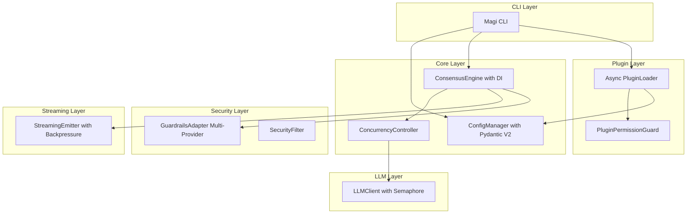
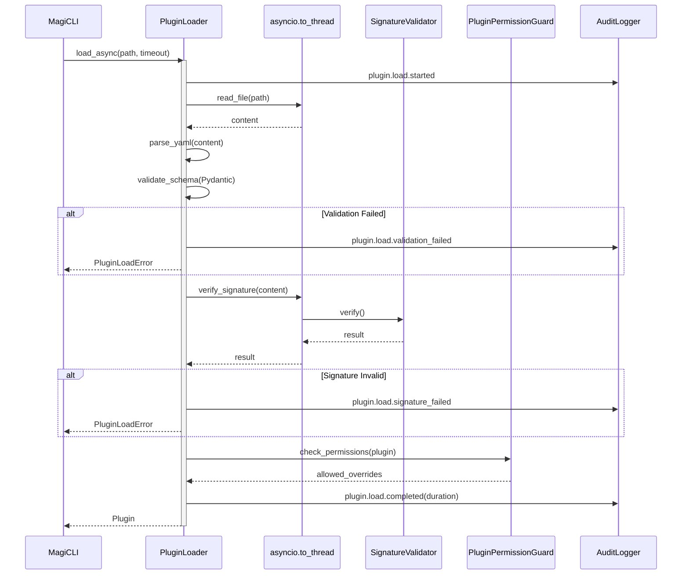
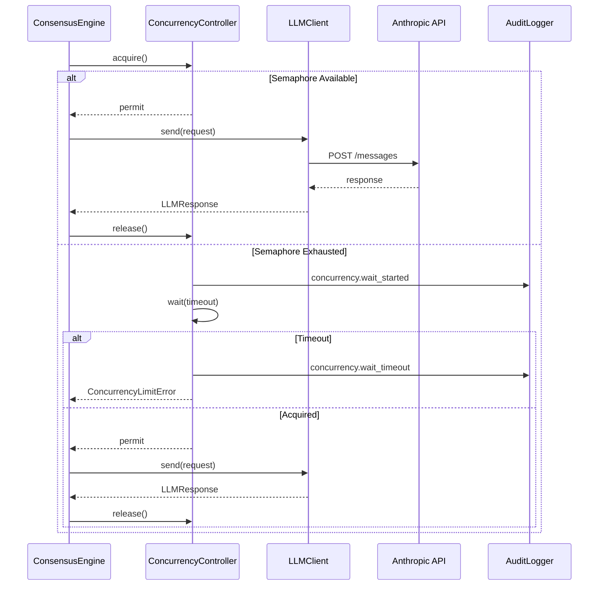
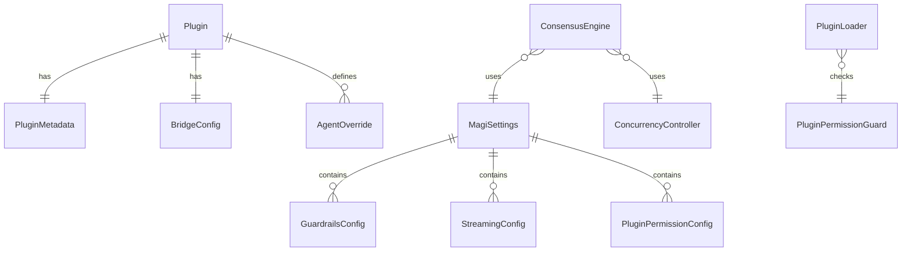

# 技術設計ドキュメント: System Hardening Refactor

## 概要

**目的**: MAGI System の性能、信頼性、保守性、セキュリティを包括的に強化し、本番運用に耐えうる堅牢なシステムを構築する。

**対象ユーザー**: 運用者（プラグイン管理）、開発者（テストと拡張）、CLI 利用者（安定した合議結果の取得）、セキュリティ担当（入力境界とプラグイン権限の管理）。

**影響範囲**: `PluginLoader`, `ConsensusEngine`, `ConfigManager`, `LLMClient`, `QueueStreamingEmitter`, `GuardrailsAdapter` の内部実装を刷新し、Pydantic V2 によるスキーマ統一と `asyncio` 並行処理制御を導入する。

### ゴール
- プラグインロードの非同期化・タイムアウト・隔離（要件 1）
- LLM 同時実行数のセマフォ制御（要件 2）
- ストリーミング出力のバックプレッシャー/ドロップ方針の設定化（要件 3）
- 主要コンポーネントの DI 対応によるテスト容易性向上（要件 4）
- Pydantic V2 による設定と入力の宣言的バリデーション（要件 5, 6）
- Guardrails プロバイダの拡張性と fail ポリシー明確化（要件 7）
- プラグインによるプロンプト上書き権限の分離（要件 8）
- 本番運用モードでの公開鍵パス厳格化（要件 9）

### 非ゴール
- 新規 LLM プロバイダの追加（OpenAI/Gemini 対応は既存機能の維持のみ）
- UI/Web インターフェースの構築
- プラグインランタイムのサンドボックス化（将来検討）

## アーキテクチャ

### 既存アーキテクチャ分析
- **現在のパターン**: CLI → ConsensusEngine → Agent/LLM → Output/Plugins の階層構造
- **維持すべき境界**: Core/Plugin 分離、Thinking/Debate/Voting の合議フロー
- **統合ポイント**: `ConfigManager` による設定ロード、`PluginLoader` によるプラグイン拡張
- **対処する技術的負債**: 同期ブロッキング I/O、手動バリデーション、ハードコードされた設定値

### アーキテクチャパターン & 境界マップ



**アーキテクチャ統合**:
- **選択パターン**: 段階的リファクタリング（既存クラス構造を維持しつつ内部を強化）
- **ドメイン/機能境界**: Core（合議）/ Plugin（拡張）/ Security（入力防御）/ Config（設定）の 4 層を維持
- **維持する既存パターン**: 合議フロー（Thinking/Debate/Voting）、Core/Plugin 分離、fail-open/fail-closed ポリシー
- **新規コンポーネントの根拠**: `ConcurrencyController`（セマフォ管理の責務分離）、`PluginPermissionGuard`（権限チェックの責務分離）
- **ステアリング準拠**: CLI ベースの統合、asyncio 全面採用、監査可能なログ出力

### 技術スタック

| レイヤー | 選択/バージョン | 機能における役割 | 備考 |
|---------|----------------|-----------------|------|
| Backend / Services | Python 3.11+ | ランタイム、asyncio 並行処理 | 既存維持 |
| Data Validation | Pydantic 2.12.5 | 設定・入力の宣言的バリデーション | **新規追加** (Lockfile準拠) |
| Async I/O | asyncio.to_thread | ブロッキング I/O のオフロード | 標準ライブラリ使用 |
| Concurrency | asyncio.Semaphore | LLM 同時実行数制御 | 標準ライブラリ使用 |
| Messaging / Events | QueueStreamingEmitter | ストリーミング出力のバッファリング | 既存拡張 |
| Security | cryptography 42.0.0 | プラグイン署名検証 | 既存維持 (Repo準拠) |

> **Note**: 上記のバージョンは `uv.lock` および `pyproject.toml` と同期し、更新時には実態に合わせて修正してください。

## システムフロー

### プラグインロードフロー（非同期化後）



**キーデシジョン**:
- ファイル読み込みと署名検証を `to_thread` でオフロードし、イベントループをブロックしない
- 個別タイムアウトを適用し、タイムアウト時は当該プラグインのみ無効化
- ロード開始/終了/所要時間を監査ログに記録

### LLM 同時実行制御フロー



**キーデシジョン**:
- `ConcurrencyController` がセマフォを管理し、同時実行数を `MAGI_LLM_CONCURRENCY_LIMIT`（デフォルト 5）で制限
- 待機時間と待機数を監視ログに記録

## 要件トレーサビリティ

| 要件 | サマリー | コンポーネント | インターフェース | フロー |
|------|---------|---------------|-----------------|-------|
| 1.1 | プラグインタイムアウト | PluginLoader | PluginLoaderService | プラグインロードフロー |
| 1.2 | タイムアウト時の無効化とログ | PluginLoader, AuditLogger | PluginLoaderService | プラグインロードフロー |
| 1.3 | 失敗プラグインの隔離 | PluginLoader | PluginLoaderService | プラグインロードフロー |
| 1.4 | 同時ロード数制限 | PluginLoader | PluginLoaderService | プラグインロードフロー |
| 1.5 | ロード監査ログ | AuditLogger | - | - |
| 2.1 | LLM 同時実行上限 | ConcurrencyController | ConcurrencyService | LLM 同時実行制御フロー |
| 2.2 | 待機/拒否とログ | ConcurrencyController | ConcurrencyService | LLM 同時実行制御フロー |
| 2.3 | レート制限時の再試行抑制 | LLMClient | - | - |
| 2.4 | クオーラム未達まで継続 | ConsensusEngine | - | - |
| 2.5 | 同時実行数監視ログ | ConcurrencyController | - | - |
| 2.6 | トークン予算の管理・制御 | TokenBudgetManager | TokenBudgetManagerProtocol | - |
| 3.1 | バッファ上限とポリシー設定 | StreamingEmitter | StreamingConfig | - |
| 3.2 | バックプレッシャ/ドロップ処理 | StreamingEmitter | - | - |
| 3.3 | 欠落ログ | StreamingEmitter | - | - |
| 3.4 | 最終結果の欠落防止 | StreamingEmitter | - | - |
| 3.5 | TTFB/遅延/欠落率ログ | StreamingEmitter | - | - |
| 4.1 | DI 対応 | ConsensusEngine | - | - |
| 4.2 | デフォルト実装 | ConsensusEngine | - | - |
| 4.3 | モック依存でのテスト | ConsensusEngine | - | - |
| 4.4 | 分岐再現可能性 | ConsensusEngine | - | - |
| 5.1 | 設定値一元化 | MagiSettings | SettingsSchema | - |
| 5.2 | 設定ソース優先順位 | MagiSettings | - | - |
| 5.3 | 型不一致/制約違反時のエラー | MagiSettings | - | - |
| 5.4 | 未知キーの警告/エラー | MagiSettings | - | - |
| 5.5 | 実効設定の診断出力 | MagiSettings | - | - |
| 6.1 | 宣言的スキーマ検証 | Pydantic Models | - | - |
| 6.2 | 検証失敗時のエラー詳細 | Pydantic Models | - | - |
| 6.3 | ロード前検証完了 | PluginLoader, ConfigManager | - | - |
| 6.4 | 統一エラー分類 | MagiException | - | - |
| 7.1 | 複数 Guardrails プロバイダ | GuardrailsAdapter | GuardrailsProvider | - |
| 7.2 | 判定結果の監査ログ | GuardrailsAdapter | - | - |
| 7.3 | タイムアウト/例外時のポリシー適用 | GuardrailsAdapter | - | - |
| 7.4 | 拒否時の遮断/安全化 | GuardrailsAdapter | - | - |
| 8.1 | プロンプト変更範囲の設定 | PluginPermissionGuard | PluginPermissionConfig | - |
| 8.2 | 許可外変更の拒否とログ | PluginPermissionGuard | - | - |
| 8.3 | 信頼判定による権限付与 | PluginPermissionGuard | - | - |
| 8.4 | プロンプト変更の監査ログ | PluginPermissionGuard | - | - |
| 9.1 | 本番モードでの厳格な鍵パス解決 | PluginLoader | - | - |
| 9.2 | 解決不可時のエラー | PluginLoader | - | - |
| 9.3 | 解決元の監査ログ | PluginLoader | - | - |

## コンポーネントとインターフェース

| コンポーネント | ドメイン/レイヤー | 意図 | 要件カバレッジ | 主要依存 (P0/P1) | コントラクト |
|---------------|------------------|------|---------------|-----------------|-------------|
| MagiSettings | Config | Pydantic V2 による設定モデル | 5.1-5.5, 6.1-6.4 | - | Service, State |
| PluginLoader | Plugin | 非同期プラグインロード | 1.1-1.5, 9.1-9.3 | MagiSettings (P0) | Service |
| PluginPermissionGuard | Plugin | プロンプト変更権限チェック | 8.1-8.4 | MagiSettings (P0) | Service |
| ConcurrencyController | Core | LLM 同時実行数制御 | 2.1-2.5 | - | Service |
| ConsensusEngine | Core | 合議フロー（DI 拡張） | 4.1-4.4 | ConcurrencyController (P0), LLMClient (P0) | Service |
| StreamingEmitter | Core | バックプレッシャ対応ストリーミング | 3.1-3.5 | MagiSettings (P1) | Service, State |
| TokenBudgetManager | Core | トークン消費の追跡と予算制御 | 2.6 | ConsensusEngineFactory (P0) | Service |
| GuardrailsAdapter | Security | マルチプロバイダ Guardrails | 7.1-7.4 | MagiSettings (P1) | Service |
| LLMClient | LLM | API 通信（レート制限対応） | 2.3 | ConcurrencyController (P0) | Service |

### Config Layer

#### MagiSettings

| フィールド | 詳細 |
|---------|------|
| Intent | Pydantic V2 BaseSettings による設定の一元管理とバリデーション |
| Requirements | 5.1, 5.2, 5.3, 5.4, 5.5, 6.1, 6.2, 6.3, 6.4 |

**責務と制約**
- 環境変数、設定ファイル (`magi.yaml`)、コマンドライン引数からの設定ロード
- 型変換とバリデーションを Pydantic で自動実行
- 機微情報（API キー）のマスク処理

**依存関係**
- Inbound: CLI, ConsensusEngine, PluginLoader — 設定値取得 (P0)
- External: pydantic-settings — 環境変数ロード (P0)

**コントラクト**: Service [x] / State [x]

##### Service Interface

```python
from pydantic import BaseModel, Field, field_validator
from pydantic_settings import BaseSettings, SettingsConfigDict
from typing import Literal, Optional
from pathlib import Path

class MagiSettings(BaseSettings):
    """MAGI System の統合設定モデル"""
    
    model_config = SettingsConfigDict(
        env_prefix="MAGI_",
        env_file=".env",
        extra="forbid",  # 未知キーをエラー (5.4)
    )
    
    # API 設定
    api_key: str = Field(..., description="Anthropic API Key")
    model: str = Field(default="claude-sonnet-4-20250514")
    timeout: int = Field(default=60, ge=1)
    retry_count: int = Field(default=3, ge=0, le=10)
    
    # 合議設定
    debate_rounds: int = Field(default=1, ge=1)
    voting_threshold: Literal["majority", "unanimous"] = "majority"
    quorum_threshold: int = Field(default=2, ge=1, le=3)
    token_budget: int = Field(default=8192, ge=1)
    
    # 並行処理設定
    llm_concurrency_limit: int = Field(default=5, ge=1, le=20)
    plugin_concurrency_limit: int = Field(default=3, ge=1, le=10)
    plugin_load_timeout: float = Field(default=30.0, gt=0)
    
    # ストリーミング設定
    streaming_enabled: bool = False
    streaming_queue_size: int = Field(default=100, ge=1)
    streaming_overflow_policy: Literal["drop", "backpressure"] = "drop"
    streaming_emit_timeout: float = Field(default=2.0, gt=0)
    
    # Guardrails 設定
    guardrails_enabled: bool = False
    guardrails_timeout: float = Field(default=3.0, gt=0)
    guardrails_on_timeout: Literal["fail-open", "fail-closed"] = "fail-closed"
    guardrails_on_error: Literal["fail-open", "fail-closed"] = "fail-closed"
    
    # プラグイン権限設定
    plugin_prompt_override_allowed: bool = False
    plugin_trusted_signatures: list[str] = Field(default_factory=list)
    
    # 本番運用モード
    production_mode: bool = False
    plugin_public_key_path: Optional[Path] = None
    
    # 出力設定
    output_format: Literal["json", "markdown"] = "markdown"
    
    @field_validator("plugin_public_key_path", mode="after")
    @classmethod
    def validate_production_key_path(cls, v, info):
        """本番モードでは公開鍵パスを必須とする (9.1, 9.2)"""
        if info.data.get("production_mode") and v is None:
            raise ValueError(
                "production_mode=True では plugin_public_key_path の明示指定が必須です"
            )
        return v
    
    def dump_masked(self) -> dict:
        """機微情報をマスクした設定を返す (5.5)"""
        data = self.model_dump()
        if "api_key" in data:
            key = data["api_key"]
            data["api_key"] = f"{key[:8]}...{key[-4:]}" if len(key) > 12 else "***"
        return data
```

- Preconditions: 環境変数または設定ファイルが読み込み可能
- Postconditions: 全フィールドがバリデーション済み
- Invariants: `production_mode=True` の場合、`plugin_public_key_path` は `None` ではない

**実装ノート**
- Integration: 既存 `ConfigManager.load()` を `MagiSettings()` 呼び出しに置き換え
- Validation: Pydantic の `field_validator` でクロスフィールドバリデーションを実装
- Risks: 既存コードの `Config` 参照箇所を全て更新する必要がある

---

### Plugin Layer

#### PluginLoader

| フィールド | 詳細 |
|---------|------|
| Intent | 非同期でプラグインをロード・検証し、タイムアウトと隔離を適用 |
| Requirements | 1.1, 1.2, 1.3, 1.4, 1.5, 6.1, 6.2, 6.3, 9.1, 9.2, 9.3 |

**責務と制約**
- YAML ファイルの非同期読み込み
- Pydantic モデルによるスキーマ検証
- 署名/ハッシュ検証（`to_thread` によるオフロード）
- 個別タイムアウトと同時ロード数制限

**依存関係**
- Inbound: CLI — プラグインロード要求 (P0)
- Outbound: PluginPermissionGuard — 権限チェック (P0)
- External: cryptography — 署名検証 (P0)

**コントラクト**: Service [x]

##### Service Interface

```python
from typing import Protocol, Optional, Literal, Any
from pathlib import Path
from pydantic import BaseModel, Field
import asyncio

# 型定義のプレースホルダー
Plugin = Any
PluginLoadResult = Any

class PluginMetadataModel(BaseModel):
    """プラグインメタデータの Pydantic モデル"""
    name: str
    version: str = "1.0.0"
    description: str = ""
    signature: Optional[str] = None
    hash: Optional[str] = None

class BridgeConfigModel(BaseModel):
    """ブリッジ設定の Pydantic モデル"""
    command: str
    interface: Literal["stdio", "file"]
    timeout: int = Field(default=30, gt=0)

class PluginModel(BaseModel):
    """プラグイン定義の Pydantic モデル"""
    plugin: PluginMetadataModel
    bridge: BridgeConfigModel
    agent_overrides: dict[str, str] = Field(default_factory=dict)

class PluginLoaderService(Protocol):
    """非同期プラグインローダーインターフェース"""
    
    async def load_async(
        self,
        path: Path,
        timeout: Optional[float] = None,
    ) -> Plugin:
        """
        プラグインを非同期でロードする。
        
        Args:
            path: プラグイン定義ファイルのパス
            timeout: 個別タイムアウト（秒）。None の場合は設定値を使用。
        
        Returns:
            検証済み Plugin オブジェクト
        
        Raises:
            PluginLoadError: ロード/検証失敗時
            asyncio.TimeoutError: タイムアウト発生時
        """
        ...
    
    async def load_all_async(
        self,
        paths: list[Path],
        concurrency_limit: Optional[int] = None,
    ) -> list[PluginLoadResult]:
        """
        複数プラグインを同時ロード数制限付きでロードする。
        
        Args:
            paths: プラグイン定義ファイルのパスリスト
            concurrency_limit: 同時ロード数上限。None の場合は設定値を使用。
        
        Returns:
            各プラグインのロード結果（成功/失敗を含む）
        """
        ...
```

- Preconditions: `path` が存在する有効なファイルパス
- Postconditions: 成功時は `Plugin` オブジェクトを返却、失敗時は例外
- Invariants: `production_mode` 時は CWD フォールバックを使用しない

---

#### PluginPermissionGuard

| フィールド | 詳細 |
|---------|------|
| Intent | プラグインによるプロンプト変更の権限チェックと監査 |
| Requirements | 8.1, 8.2, 8.3, 8.4 |

**責務と制約**
- `agent_overrides` の変更範囲を検証
- 信頼されたプラグイン（署名済み）のみ上書き権限を付与
- 許可外変更の拒否とログ記録

**依存関係**
- Inbound: PluginLoader — 権限チェック要求 (P0)
- Outbound: MagiSettings — 権限設定参照 (P0)

**コントラクト**: Service [x]

##### Service Interface

```python
from dataclasses import dataclass, field
from typing import Optional, Protocol, Any
from enum import Enum

# 型定義のプレースホルダー
Plugin = Any

class OverrideScope(Enum):
    """プロンプト変更の範囲"""
    CONTEXT_ONLY = "context_only"  # 追加コンテキストのみ
    FULL_OVERRIDE = "full_override"  # 完全上書き

@dataclass
class PermissionCheckResult:
    """権限チェック結果"""
    allowed: bool
    scope: OverrideScope
    reason: Optional[str] = None
    filtered_overrides: dict[str, str] = field(default_factory=dict)

class PluginPermissionGuardService(Protocol):
    """プラグイン権限ガードインターフェース"""
    
    def check_override_permission(
        self,
        plugin: Plugin,
        requested_overrides: dict[str, str],
    ) -> PermissionCheckResult:
        """
        プロンプト上書き権限をチェックする。
        
        Args:
            plugin: 検証済みプラグイン
            requested_overrides: 要求された agent_overrides
        
        Returns:
            権限チェック結果（許可/拒否、許可された範囲、フィルタ済み上書き）
        """
        ...
```

---

### Core Layer

#### ConcurrencyController

| フィールド | 詳細 |
|---------|------|
| Intent | asyncio.Semaphore による LLM 同時実行数の制御と監視 |
| Requirements | 2.1, 2.2, 2.5 |

##### 責務と制約

- **プロセス全体で単一インスタンス（シングルトン）として管理** (要件 2.1 のプロセス全体の上限を保証)
- グローバルセマフォによる同時実行数制御
- 待機数と待機時間の記録
- タイムアウト時の拒否

##### 依存関係

- Inbound: ConsensusEngine, LLMClient — 同時実行制御 (P0)
- Outbound: MagiSettings — 上限値参照 (P1)

**ライフサイクル管理**
- `MagiCLI` またはアプリケーションルートで初期化され、全ての `ConsensusEngine` インスタンスに注入される
- `ConsensusEngineFactory` のデフォルト引数は **テスト専用** であり、本番環境では明示的な注入が必須

**コントラクト**: Service [x]

##### Service Interface

```python
from contextlib import asynccontextmanager
from typing import AsyncGenerator, Optional, Protocol
from dataclasses import dataclass

@dataclass
class ConcurrencyMetrics:
    """同時実行数メトリクス"""
    active_count: int
    waiting_count: int
    total_acquired: int
    total_timeouts: int
    total_rate_limits: int

class ConcurrencyControllerService(Protocol):
    """同時実行制御インターフェース"""
    
    @asynccontextmanager
    async def acquire(
        self,
        timeout: Optional[float] = None,
    ) -> AsyncGenerator[None, None]:
        """
        同時実行許可を取得する。コンテキストマネージャとして使用。
        
        Args:
            timeout: 待機タイムアウト（秒）。None の場合は無制限待機。
        
        Raises:
            ConcurrencyLimitError: タイムアウト発生時
        
        Example:
            async with controller.acquire(timeout=10.0):
                response = await llm_client.send(request)
        """
        ...
    
    def get_metrics(self) -> ConcurrencyMetrics:
        """現在のメトリクスを取得する"""
        ...
    
    def note_rate_limit(self) -> None:
        """レート制限発生を記録する"""
        ...
```

---

#### ConsensusEngine (DI 拡張)

| フィールド | 詳細 |
|---------|------|
| Intent | 合議フローの実行（依存注入対応） |
| Requirements | 4.1, 4.2, 4.3, 4.4 |

**責務と制約**
- Thinking/Debate/Voting フェーズの実行
- 主要依存（PersonaManager, ContextManager, LLMClient, StreamingEmitter）の注入対応
- デフォルト実装によるフォールバック

**依存関係**
- Inbound: CLI — 合議実行要求 (P0)
- Outbound: ConcurrencyController — 同時実行制御 (P0)
- Outbound: LLMClient — API 通信 (P0)
- Outbound: StreamingEmitter — 出力 (P1)
- Outbound: GuardrailsAdapter — 入力チェック (P1)

**コントラクト**: Service [x]

##### Service Interface

```python
from typing import Optional, Callable, Protocol, Any

# 型定義のプレースホルダー
PersonaType = Any
Persona = Any
Context = Any
MagiSettings = Any
LLMClient = Any
ConcurrencyController = Any
StreamingEmitter = Any
GuardrailsAdapter = Any
ConsensusEngine = Any

class PersonaManagerProtocol(Protocol):
    """ペルソナマネージャインターフェース（モック用）"""
    def get_persona(self, persona_type: PersonaType) -> Persona: ...

class ContextManagerProtocol(Protocol):
    """コンテキストマネージャインターフェース（モック用）"""
    def get_context(self) -> Context: ...

class TokenBudgetManagerProtocol(Protocol):
    """トークン予算管理インターフェース（モック用）"""
    def check_budget(self, estimated_tokens: int) -> bool: ...
    def consume(self, actual_tokens: int) -> None: ...

class ConsensusEngineFactory:
    """DI 対応 ConsensusEngine ファクトリ"""
    
    @staticmethod
    def create(
        settings: MagiSettings,
        *,
        persona_manager: Optional[PersonaManagerProtocol] = None,
        context_manager: Optional[ContextManagerProtocol] = None,
        llm_client_factory: Optional[Callable[[], LLMClient]] = None,
        concurrency_controller: Optional[ConcurrencyController] = None,
        streaming_emitter: Optional[StreamingEmitter] = None,
        guardrails_adapter: Optional[GuardrailsAdapter] = None,
        token_budget_manager: Optional[TokenBudgetManagerProtocol] = None,
    ) -> ConsensusEngine:
        """
        依存を注入して ConsensusEngine を生成する。
        
        Args:
            settings: 設定オブジェクト
            persona_manager: ペルソナマネージャ（None の場合はデフォルト）
            context_manager: コンテキストマネージャ（None の場合はデフォルト）
            llm_client_factory: LLMClient 生成関数（None の場合はデフォルト）
            concurrency_controller: 同時実行制御（None の場合はデフォルト、テスト用）
            streaming_emitter: ストリーミングエミッタ（None の場合はデフォルト）
            guardrails_adapter: Guardrails アダプタ（None の場合はデフォルト）
            token_budget_manager: トークン予算管理（None の場合はデフォルト）
        
        Returns:
            設定済み ConsensusEngine
        
        Note:
            本番環境では concurrency_controller を明示的に注入すること。
            デフォルト値（None）はテスト専用であり、プロセス全体の同時実行制御を保証しない。
        """
        ...
```

---

#### StreamingEmitter (バックプレッシャ対応)

| フィールド | 詳細 |
|---------|------|
| Intent | ストリーミング出力のバッファリングとバックプレッシャ/ドロップ制御 |
| Requirements | 3.1, 3.2, 3.3, 3.4, 3.5 |

**責務と制約**
- キューサイズと溢れ時ポリシー（drop/backpressure）の設定対応
- 欠落件数と理由のログ記録
- 最終結果の欠落防止（優先キュー）

**依存関係**
- Inbound: ConsensusEngine — 出力要求 (P0)
- Outbound: MagiSettings — 設定参照 (P1)

**コントラクト**: Service [x] / State [x]

##### Service Interface

```python
from typing import Protocol, Optional, Literal
import asyncio

class StreamingEmitterService(Protocol):
    """ストリーミング出力インターフェース"""
    
    async def emit(
        self,
        event_type: str,
        content: str,
        priority: Literal["normal", "critical"] = "normal",
    ) -> None:
        """
        イベントを非同期で出力する。
        
        Args:
            event_type: イベント種別（例: "thinking", "debate", "result"）
            content: 出力内容
            priority: 優先度。"critical" は最終結果など欠落を許容しないイベント。
        
        Raises:
            StreamingTimeoutError: バックプレッシャモードでタイムアウト発生時
        
        Note:
            - バックプレッシャモード時、キューが一杯の場合は待機する（非同期）
            - ドロップモード時、キューが一杯の場合は即座にドロップしてログ記録
            - priority="critical" のイベントは常にバックプレッシャを適用
        """
        ...
    
    def get_state(self) -> "StreamingState":
        """現在のストリーミング状態を取得する"""
        ...
```

- Preconditions: `enabled=True` の場合のみ出力を実行
- Postconditions: イベントがキューに追加されるか、ドロップがログ記録される
- Invariants: `priority="critical"` のイベントは決してドロップされない

##### State Management

`StreamingState`は、`MagiSettings`で定義されるストリーミング関連の設定（例: `streaming_enabled`, `streaming_queue_size`, `streaming_overflow_policy`）に基づいて初期化され、`StreamingEmitter`の現在の動作状態を反映します。

```python
from dataclasses import dataclass
from typing import Literal, Optional

@dataclass
class StreamingState:
    """ストリーミング状態"""
    enabled: bool
    overflow_policy: Literal["drop", "backpressure"]
    queue_size: int
    current_queue_length: int
    emitted_count: int
    dropped_count: int
    ttfb_ms: Optional[float]
    elapsed_ms: Optional[float]
    last_drop_reason: Optional[str]
```

---

### Security Layer

#### GuardrailsAdapter (マルチプロバイダ対応)

| フィールド | 詳細 |
|---------|------|
| Intent | 複数 Guardrails プロバイダの統合と fail ポリシー適用 |
| Requirements | 7.1, 7.2, 7.3, 7.4 |

**責務と制約**
- 複数プロバイダの順次評価
- タイムアウト/例外時の fail-open/fail-closed 適用
- 判定結果の監査ログ

**依存関係**
- Inbound: ConsensusEngine — 入力チェック要求 (P1)
- Outbound: MagiSettings — ポリシー設定参照 (P0)

**コントラクト**: Service [x]

##### Service Interface

```python
from typing import Protocol, Any

# 型定義のプレースホルダー
GuardrailsDecision = Any

class GuardrailsProviderProtocol(Protocol):
    """カスタム Guardrails プロバイダインターフェース"""
    name: str
    enabled: bool
    
    async def evaluate(self, prompt: str) -> GuardrailsDecision:
        """プロンプトを評価する"""
        ...

# 既存の GuardrailsAdapter を拡張してプロバイダ登録をサポート
class GuardrailsAdapter:
    def register_provider(self, provider: GuardrailsProviderProtocol) -> None:
        """カスタムプロバイダを登録する"""
        ...
```

---

## データモデル

### ドメインモデル



### 論理データモデル

**設定構造**:
- `MagiSettings`: ルート設定エンティティ。Pydantic BaseSettings として実装。
- `GuardrailsConfig`, `StreamingConfig`, `PluginPermissionConfig`: ネストされた設定セクション。

**プラグイン構造**:
- `PluginModel`: プラグイン定義の Pydantic モデル。既存の `dataclass` を置き換え。
- `PluginMetadataModel`, `BridgeConfigModel`: サブモデル。

**整合性**:
- 設定ロード時に全フィールドをバリデーション
- プラグインロード時にスキーマ検証を必須化

---

## エラーハンドリング

### エラー戦略
- **早期検証**: Pydantic による起動時バリデーション
- **グレースフルデグラデーション**: プラグインロード失敗時は当該プラグインのみ無効化
- **ユーザーコンテキスト**: 修正可能なエラーメッセージを提示

### エラーカテゴリと対応

| エラー種別 | 対応 | ログレベル |
|-----------|------|-----------|
| 設定バリデーション失敗 | 起動拒否、詳細エラー表示 | ERROR |
| プラグインタイムアウト | 該当プラグイン無効化、処理継続 | WARNING |
| 署名検証失敗 | ロード拒否、監査ログ | WARNING |
| 同時実行タイムアウト | リクエスト拒否/待機 | WARNING |
| Guardrails タイムアウト | ポリシーに従い fail-open/closed | WARNING |
| LLM レート制限 | 再試行抑制、バックオフ | WARNING |

### 監視
- 全てのエラーは `MagiException` 派生クラスで統一
- エラーコード (`ErrorCode`) による分類
- 構造化ログによる監査対応

---

## テスト戦略

### Unit Tests
- **MagiSettings**: Pydantic バリデーション、クロスフィールドバリデーション、マスク処理
- **PluginLoader**: 非同期ロード、タイムアウト、スキーマエラー
- **ConcurrencyController**: セマフォ動作、メトリクス記録
- **PluginPermissionGuard**: 権限チェック、フィルタリング

### Integration Tests
- **設定ロード**: 環境変数 + ファイル + デフォルトの優先順位
- **プラグインロード**: 複数プラグインの同時ロード、失敗時の隔離
- **合議フロー**: DI 注入されたモックでの完全フロー

### Property Tests
- **MagiSettings**: 任意の有効な設定値でのバリデーション成功
- **PluginLoader**: 任意のタイムアウト値での動作

### Performance Tests
- 10 プラグインの同時ロードで 5 秒以内完了
- LLM 同時実行数 5 でのスループット測定

---

## セキュリティ考慮事項

- **本番運用モード**: 公開鍵パスの曖昧なフォールバックを無効化 (9.1)
- **プラグイン権限分離**: `agent_overrides` を信頼されたプラグインのみに制限 (8.1-8.4)
- **機微情報マスク**: `api_key` のログ出力時マスク (5.5)
- **Guardrails 拡張**: 正規表現に加え、将来的に LLM ベースの判定を追加可能 (7.1)

---

## 補足参照

詳細な調査結果と設計決定の根拠は `research.md` を参照。
