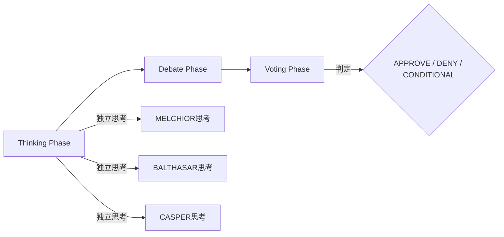
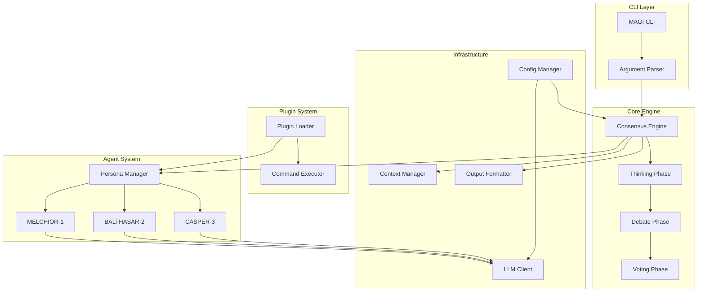

# MAGI System

<div align="center">


**3賢者による合議プロセスを通じて、多角的で信頼性の高い判断を提供するAI開発プラットフォーム**

</div>

---

## 概要

MAGIシステムは、アニメ「エヴァンゲリオン」に登場するMAGIシステムを、実用的なエンジニアリング・プラットフォームとして再構築したプロジェクトです。

従来の単一プロンプトによるAIエージェント開発から脱却し、「**合議判定コア（Core）**」と「**機能拡張（Plugins）**」を分離することで、保守性、専門性、拡張性を担保する次世代のAI開発環境を提供します。

### 🎭 3賢者（Three Magi）

| ペルソナ | 役割 | 特性 |
|---------|------|------|
| **MELCHIOR-1** | 論理・科学 | 論理的整合性と事実に基づいた分析を行う |
| **BALTHASAR-2** | 倫理・保護 | リスク回避と現状維持を優先する |
| **CASPER-3** | 欲望・実利 | ユーザーの利益と効率を最優先する |

### 📊 合議プロトコル（Consensus Protocol）

MAGIシステムは以下の3フェーズで合議を行います：



1. **Thinking Phase**: 各エージェントが独立して思考を生成
2. **Debate Phase**: エージェント間で議論・反論
3. **Voting Phase**: 投票による最終判定（APPROVE / DENY / CONDITIONAL）

## インストール

### 前提条件

- Python 3.11以上
- [uv](https://github.com/astral-sh/uv) パッケージマネージャー

### クイックスタート

```bash
# リポジトリをクローン
git clone https://github.com/yohi/magi-core.git
cd magi-core

# uvで依存関係をインストール
uv sync

# 環境変数の設定
export MAGI_API_KEY="your-anthropic-api-key"

# 動作確認
uv run magi --version
```

### PyPI からインストール（将来対応予定）

```bash
pip install magi-system
```

## 使用方法

### 基本コマンド

```bash
# ヘルプを表示
magi --help

# バージョンを表示
magi --version

# 3賢者に質問
magi ask "このコードをレビューしてください"

# 仕様書の作成とレビュー（プラグイン使用）
magi spec "ログイン機能の仕様書を作成"
```

### オプション

| オプション | 説明 | 例 |
|------------|------|-----|
| `-h, --help` | ヘルプメッセージを表示 | `magi --help` |
| `-v, --version` | バージョン情報を表示 | `magi --version` |
| `--format <format>` | 出力形式を指定（json, markdown） | `magi --format json ask "..."` |
| `--plugin <name>` | 使用するプラグインを指定 | `magi --plugin my-plugin spec "..."` |

### 使用例

```bash
# JSON形式で出力
magi --format json ask "リファクタリングの提案をしてください"

# 特定のプラグインを使用
magi --plugin magi-cc-sdd-plugin spec "APIエンドポイントの仕様書"

# Debateラウンド数を環境変数で指定
MAGI_DEBATE_ROUNDS=3 magi ask "このアーキテクチャの問題点は？"
```

## 設定

### 環境変数

| 変数名 | 説明 | デフォルト |
|--------|------|-----------|
| `MAGI_API_KEY` | Anthropic APIキー（**必須**） | - |
| `MAGI_MODEL` | 使用するLLMモデル | `claude-sonnet-4-20250514` |
| `MAGI_DEBATE_ROUNDS` | Debateフェーズのラウンド数 | `1` |
| `MAGI_VOTING_THRESHOLD` | 投票閾値（majority/unanimous） | `majority` |
| `MAGI_TIMEOUT` | APIタイムアウト（秒） | `60` |

### 設定ファイル（magi.yaml）

プロジェクトルートに `magi.yaml` を配置することで、設定をカスタマイズできます：

```yaml
# magi.yaml
model: claude-sonnet-4-20250514
debate_rounds: 2
voting_threshold: majority
output_format: markdown
timeout: 120
retry_count: 3

# ペルソナ個別設定 (オプション)
# キーは melchior / balthasar / casper (小文字) を推奨
personas:
  melchior:
    llm:
      model: claude-3-opus-20240229  # 論理担当に高性能モデルを割り当て
      temperature: 0.0            # 厳密な論理的整合性のために低く設定 (0.0-1.0)
  casper:
    llm:
      timeout: 180  # 複雑な処理のためにタイムアウトを延長
# 個別設定がない項目はグローバル設定が使用されます
```

## プラグイン開発

### プラグイン構造

```
plugins/
└── my-plugin/
    └── plugin.yaml
```

### plugin.yaml スキーマ

```yaml
plugin:
  name: my-plugin              # プラグイン名（必須）
  version: "1.0.0"             # バージョン（任意）
  description: "説明文"         # 説明（必須）

bridge:
  command: my-command          # 実行するコマンド（必須）
  interface: stdio             # インターフェース種別（stdio/file）
  timeout: 30                  # タイムアウト秒数

agent_overrides:
  melchior: |                  # MELCHIOR向けの追加指示
    ... 専門的な指示 ...
  balthasar: |                 # BALTHASAR向けの追加指示
    ... 専門的な指示 ...
  casper: |                    # CASPER向けの追加指示
    ... 専門的な指示 ...
```

### サンプルプラグイン（magi-cc-sdd-plugin）

仕様書駆動開発（SDD）のためのサンプルプラグインが `plugins/magi-cc-sdd-plugin/` に含まれています：

```bash
# SDDプラグインを使用して仕様書を作成
magi spec "ユーザー認証APIの仕様書を作成してください"
```

このプラグインは：
- `cc-sdd` コマンドを使用して仕様書を生成
- 各エージェントに仕様書レビュー専用の指示を注入
- 論理的整合性、セキュリティリスク、ユーザー価値の観点からレビュー

## 開発

詳細な開発ガイドライン（コーディング規約、言語ポリシー等）については [AGENTS.md](AGENTS.md) を参照してください。

### 開発環境のセットアップ

```bash
# リポジトリをクローン
git clone https://github.com/yohi/magi-core.git
cd magi-core

# 開発依存関係を含めてインストール
uv sync

# テストの実行
uv run python -m unittest discover -s tests -v
```

### テスト

```bash
# ユニットテスト
uv run python -m unittest discover -s tests/unit -v

# プロパティベーステスト（Hypothesis）
uv run python -m unittest discover -s tests/property -v

# 統合テスト
uv run python -m unittest discover -s tests/integration -v

# 全テスト実行
uv run python -m unittest discover -s tests -v

# 特定のテストケースを実行
uv run python -m unittest tests.unit.test_cli.TestArgumentParser.test_parse_help_short

# カバレッジ付きテスト
uv run coverage run -m unittest discover -s tests
uv run coverage report
uv run coverage html  # HTMLレポート生成
```

### プロジェクト構造

```
magi-core/
├── src/
│   └── magi/
│       ├── __init__.py       # パッケージ初期化
│       ├── __main__.py       # CLIエントリーポイント
│       ├── models.py         # 共通データモデル
│       ├── errors.py         # エラー定義
│       ├── agents/           # エージェントシステム
│       │   ├── persona.py    # ペルソナ管理
│       │   └── agent.py      # エージェント実装
│       ├── cli/              # CLIレイヤー
│       │   ├── parser.py     # 引数パーサー
│       │   └── main.py       # MagiCLI
│       ├── config/           # 設定管理
│       │   └── manager.py    # ConfigManager
│       ├── core/             # コアエンジン
│       │   ├── consensus.py  # 合議エンジン
│       │   └── context.py    # コンテキスト管理
│       ├── llm/              # LLM通信
│       │   └── client.py     # LLMClient
│       ├── output/           # 出力フォーマット
│       │   └── formatter.py  # OutputFormatter
│       └── plugins/          # プラグインシステム
│           ├── loader.py     # PluginLoader
│           └── executor.py   # CommandExecutor
├── tests/
│   ├── unit/                 # ユニットテスト
│   ├── property/             # プロパティベーステスト
│   └── integration/          # 統合テスト
├── plugins/                  # プラグインディレクトリ
│   └── magi-cc-sdd-plugin/   # SDDプラグイン
├── docs/                     # ドキュメント
├── pyproject.toml            # プロジェクト設定
└── README.md                 # このファイル
```

## アーキテクチャ



## 投票結果と終了コード

| 投票結果 | Exit Code | 説明 |
|---------|-----------|------|
| APPROVE | 0 | 全員または過半数が承認 |
| DENY | 1 | 全員または過半数が否決 |
| CONDITIONAL | 2 | 条件付き承認（条件の詳細が出力に含まれる） |

## ライセンス

MIT License

Copyright (c) 2024 MAGI System Contributors

## コントリビューション

プルリクエストや課題の報告は大歓迎です！

1. リポジトリをフォーク
2. フィーチャーブランチを作成 (`git checkout -b feature/amazing-feature`)
3. 変更をコミット (`git commit -m 'Add some amazing feature'`)
4. ブランチをプッシュ (`git push origin feature/amazing-feature`)
5. プルリクエストを作成

## 関連リンク

- [Anthropic API Documentation](https://docs.anthropic.com/)
- [cc-sdd（仕様書駆動開発ツール）](https://github.com/yohi/cc-sdd)

---

<div align="center">

**"The three computers that govern NERV."**

</div>
