# MAGI System

<div align="center">


**3賢者による合議プロセスを通じて、多角的で信頼性の高い判断を提供するAI開発プラットフォーム**

</div>

---

## 概要

MAGIシステムは、アニメ「エヴァンゲリオン」に登場するMAGIシステムを、実用的なエンジニアリング・プラットフォームとして再構築したプロジェクトです。

従来の単一プロンプトによるAIエージェント開発から脱却し、「**合議判定コア（Core）**」と「**機能拡張（Plugins）**」を分離することで、保守性、専門性、拡張性を担保する次世代のAI開発環境を提供します。

### 🚀 特徴

*   **マルチモデル合議 (Multi-Model Consensus)**: 各賢者に異なるLLM（例: 論理担当にGPT-4、速度担当にGPT-4o mini）を割り当て、コストと精度のバランスを最適化。
*   **マルチプロバイダー対応**: Anthropic Claude, OpenAI, GitHub Copilot, Google Gemini, Antigravity など、主要なLLMプロバイダーをサポート。
*   **プラグイン拡張**: 仕様書生成やコードレビューなど、特定のタスクに特化した機能をプラグインとして追加可能。

### 🎭 3賢者（Three Magi）

| ペルソナ | 役割 | 特性 | 推奨モデル例 |
|---------|------|------|------------|
| **MELCHIOR-1** | 論理・科学 | 論理的整合性と事実に基づいた分析を行う | GPT-4o, Claude 3.5 Sonnet |
| **BALTHASAR-2** | 倫理・保護 | リスク回避と現状維持を優先する | GPT-4 Turbo, Claude 3 Opus |
| **CASPER-3** | 欲望・実利 | ユーザーの利益と効率を最優先する | GPT-4o mini, Haiku |

### 📊 合議プロトコル（Consensus Protocol）

MAGIシステムは以下の3フェーズで合議を行います：

```mermaid
graph LR
    A[Thinking Phase] --> B[Debate Phase] --> C[Voting Phase]
    A --> |独立思考| A1[MELCHIOR思考]
    A --> |独立思考| A2[BALTHASAR思考]
    A --> |独立思考| A3[CASPER思考]
    C --> |判定| D{APPROVE / DENY / CONDITIONAL}
```



1. **Thinking Phase**: 各エージェントが独立して思考を生成
2. **Debate Phase**: エージェント間で議論・反論
3. **Voting Phase**: 投票による最終判定（APPROVE / DENY / CONDITIONAL）

## インストール

### 前提条件

- Python 3.11以上
- [uv](https://github.com/astral-sh/uv) パッケージマネージャー

### クイックスタート

```bash
# リポジトリをクローン
git clone https://github.com/yohi/magi-core.git
cd magi-core

# uvで依存関係をインストール
uv sync

# 環境変数の設定
export MAGI_API_KEY="your-anthropic-api-key"

# 動作確認
uv run magi --version
```

### PyPI からインストール（将来対応予定）

```bash
pip install magi-system
```

## 使用方法

### 基本コマンド

```bash
# ヘルプを表示
magi --help

# バージョンを表示
magi --version

# 設定ファイルの生成
magi init

# 3賢者に質問
magi ask "このコードをレビューしてください"

# 認証（Google/Antigravity, Claude, etc.）
magi auth login antigravity

# 仕様書の作成とレビュー（プラグイン使用）
magi spec "ログイン機能の仕様書を作成"
```

### オプション

| オプション | 説明 | 例 |
|------------|------|-----|
| `-h, --help` | ヘルプメッセージを表示 | `magi --help` |
| `-v, --version` | バージョン情報を表示 | `magi --version` |
| `--format <format>` | 出力形式を指定（json, markdown） | `magi --format json ask "..."` |
| `--plugin <name>` | 使用するプラグインを指定 | `magi --plugin my-plugin spec "..."` |

### 使用例

```bash
# JSON形式で出力
magi --format json ask "リファクタリングの提案をしてください"

# 特定のプラグインを使用
magi --plugin magi-cc-sdd-plugin spec "APIエンドポイントの仕様書"

# Debateラウンド数を環境変数で指定
MAGI_DEBATE_ROUNDS=3 magi ask "このアーキテクチャの問題点は？"
```

## WebUI機能 (Preview)

MAGIシステムの合議プロセスをリアルタイムで可視化するWebインターフェースを提供しています。
現在は開発者向けのプレビュー機能として利用可能です。

### 起動方法

Docker Composeを使用して、バックエンドとフロントエンドを一括で起動できます。

```bash
docker compose up --build
```

起動後、ブラウザで以下のURLにアクセスしてください。

- URL: `http://localhost:3000`

## 設定

### 環境変数

| 変数名 | 説明 | デフォルト |
|--------|------|-----------|
| `MAGI_API_KEY` | Anthropic APIキー（**必須**） | - |
| `MAGI_MODEL` | 使用するLLMモデル | `claude-sonnet-4-20250514` |
| `MAGI_DEBATE_ROUNDS` | Debateフェーズのラウンド数 | `1` |
| `MAGI_VOTING_THRESHOLD` | 投票閾値（majority/unanimous） | `majority` |
| `MAGI_TIMEOUT` | APIタイムアウト（秒） | `60` |

### 設定ファイル（magi.yaml）

`magi init` コマンドを実行すると、プロジェクトルートに設定ファイルの雛形 (`magi.yaml`) が生成されます。
各賢者に異なるモデルを割り当てることで、コストパフォーマンスと精度の最適化が可能です。

```yaml
# magi.yaml (Global Settings)
model: claude-sonnet-4-20250514
debate_rounds: 2
voting_threshold: majority
output_format: markdown
timeout: 120
retry_count: 3

# ペルソナ個別設定 (Persona Overrides)
# 各賢者の役割に合わせて最適なモデルとパラメータを設定します
personas:
  melchior:
    llm:
      model: claude-3-opus-20240229  # 論理担当には最高精度のモデル
      temperature: 0.0            # 厳密な論理的整合性のために決定論的に
  casper:
    llm:
      model: gpt-4o-mini          # 実利担当には高速・低コストなモデル
      timeout: 180                # 複雑な処理のためにタイムアウトを延長
# 個別設定がない項目（Balthasar等）はグローバル設定が使用されます
```

### マルチプロバイダー認証 (Multi-Provider Authentication)

MAGIシステムは `claude` (Anthropic), `copilot` (GitHub Copilot), `antigravity` (Google OAuth) の各プロバイダーをサポートしています。
認証トークンは OS のキーストア (`keyring`) を使用して安全に保存されます。

#### 認証コマンド

```bash
# 認証プロバイダを選択してログイン（ブラウザ認証）
magi auth login antigravity

# ログアウト
magi auth logout antigravity

# 認証状態の確認
magi auth status
```

#### 設定例 (magi.yaml)

`magi init` で生成される設定ファイルには、主要なプロバイダの設定例が含まれています。

**Antigravity (Google OAuth):**
```yaml
providers:
  antigravity:
    model: ag-model-v1
    # Client ID / Secret は必須です。
    # magi auth login 実行時に対話的に入力するか、ここに直接記述してください。
    # options:
    #   client_id: "your-google-client-id"
    #   client_secret: "your-google-client-secret"
    #   project_id: "your-google-cloud-project-id" # 環境変数 ANTIGRAVITY_PROJECT_ID でも指定可能
```

**GitHub Copilot:**
```yaml
providers:
  copilot:
    model: gpt-4
    options:
      client_id: "Iv1.b507a08c87ecfe98" # デフォルト値あり
```

### パススルー機能 (Model Pass-Through)

以下のプロバイダおよびモデルパターンを指定した場合、リクエストは変換されずにそのまま対象APIへ転送されます。これにより、最新モデルや特定のモデルIDを即座に利用可能です。

- **OpenAI**: `gpt-`, `o1-` ~ `o9-`, `chatgpt-`, `codex` で始まるモデルID
- **Google / Antigravity**: `gemini-`, `antigravity` で始まるモデルID
- **Anthropic**: その他のモデルIDはAnthropicとして処理されます

例: `gpt-4o`, `gemini-2.0-flash-exp`, `o1-preview` などは設定なしでそのまま利用可能です。

---

## プラグイン開発

### プラグイン構造

```
plugins/
└── my-plugin/
    └── plugin.yaml
```

### plugin.yaml スキーマ

```yaml
plugin:
  name: my-plugin              # プラグイン名（必須）
  version: "1.0.0"             # バージョン（任意）
  description: "説明文"         # 説明（必須）

bridge:
  command: my-command          # 実行するコマンド（必須）
  interface: stdio             # インターフェース種別（stdio/file）
  timeout: 30                  # タイムアウト秒数

agent_overrides:
  melchior: |                  # MELCHIOR向けの追加指示
    ... 専門的な指示 ...
  balthasar: |                 # BALTHASAR向けの追加指示
    ... 専門的な指示 ...
  casper: |                    # CASPER向けの追加指示
    ... 専門的な指示 ...
```

### サンプルプラグイン（magi-cc-sdd-plugin）

仕様書駆動開発（SDD）のためのサンプルプラグインが `plugins/magi-cc-sdd-plugin/` に含まれています：

```bash
# SDDプラグインを使用して仕様書を作成
magi spec "ユーザー認証APIの仕様書を作成してください"
```

このプラグインは：
- `cc-sdd` コマンドを使用して仕様書を生成
- 各エージェントに仕様書レビュー専用の指示を注入
- 論理的整合性、セキュリティリスク、ユーザー価値の観点からレビュー

## 開発

詳細な開発ガイドライン（コーディング規約、言語ポリシー等）については [AGENTS.md](AGENTS.md) を参照してください。

### 開発環境のセットアップ

```bash
# リポジトリをクローン
git clone https://github.com/yohi/magi-core.git
cd magi-core

# 開発依存関係を含めてインストール
uv sync

# テストの実行
uv run python -m unittest discover -s tests -v
```

### テスト

```bash
# ユニットテスト
uv run python -m unittest discover -s tests/unit -v

# プロパティベーステスト（Hypothesis）
uv run python -m unittest discover -s tests/property -v

# 統合テスト
uv run python -m unittest discover -s tests/integration -v

# 全テスト実行
uv run python -m unittest discover -s tests -v

# 特定のテストケースを実行
uv run python -m unittest tests.unit.test_cli.TestArgumentParser.test_parse_help_short

# カバレッジ付きテスト
uv run coverage run -m unittest discover -s tests
uv run coverage report
uv run coverage html  # HTMLレポート生成
```

### プロジェクト構造

```
magi-core/
├── src/
│   └── magi/
│       ├── __main__.py          # CLIエントリーポイント (magi コマンド)
│       ├── models.py            # 共通データモデル (dataclass, Enum)
│       ├── errors.py            # エラーコード・例外階層
│       ├── agents/              # エージェントシステム
│       │   ├── persona.py       # ペルソナ管理
│       │   └── agent.py         # エージェント実装 (think/debate/vote)
│       ├── cli/                 # CLIレイヤー
│       │   ├── parser.py        # 引数パーサー
│       │   ├── main.py          # MagiCLI
│       │   └── model_fetcher.py # モデル一覧取得
│       ├── config/              # 設定管理
│       │   ├── manager.py       # ConfigManager
│       │   ├── provider.py      # ProviderConfigLoader (マルチプロバイダ)
│       │   └── settings.py      # MagiSettings (Pydantic V2 BaseSettings)
│       ├── core/                # コアエンジン・ハードニング
│       │   ├── consensus.py     # 合議エンジン (async)
│       │   ├── context.py       # コンテキスト管理
│       │   ├── concurrency.py   # ConcurrencyController (Semaphore)
│       │   ├── streaming.py     # QueueStreamingEmitter
│       │   ├── token_budget.py  # トークン予算管理
│       │   ├── quorum.py        # クオーラム・フェイルセーフ判定
│       │   ├── schema_validator.py # JSONスキーマ検証
│       │   ├── template_loader.py  # テンプレート外部化・キャッシュ
│       │   ├── spec_sync.py     # spec.json/tasks.md 同期
│       │   └── providers.py     # プロバイダコンテキスト定義
│       ├── llm/                 # LLM通信
│       │   ├── client.py        # LLMClient 共通インターフェース
│       │   ├── providers.py     # プロバイダアダプタ (Anthropic/OpenAI/Gemini)
│       │   ├── providers_auth.py # 認証付きプロバイダ
│       │   └── auth/            # 認証モジュール (OAuth/Copilot/Claude)
│       ├── output/              # 出力フォーマット
│       │   └── formatter.py     # OutputFormatter
│       ├── plugins/             # プラグインシステム
│       │   ├── loader.py        # PluginLoader
│       │   ├── executor.py      # CommandExecutor
│       │   ├── guard.py         # PluginGuard
│       │   ├── bridge.py        # BridgeAdapter (外部CLI連携)
│       │   ├── permission_guard.py # プロンプト上書き権限制御
│       │   └── signature.py     # プラグイン署名検証
│       ├── security/            # セキュリティ
│       │   ├── filter.py        # SecurityFilter
│       │   └── guardrails.py    # GuardrailsAdapter
│       └── webui_backend/       # FastAPI WebUI (Preview)
│           ├── app.py           # FastAPIアプリ
│           ├── adapter.py       # WebUIアダプタ
│           ├── session_manager.py # セッション管理
│           ├── broadcaster.py   # WebSocket配信
│           └── models.py        # WebUI用データモデル
├── tests/
│   ├── unit/                    # ユニットテスト
│   ├── property/                # プロパティベーステスト (Hypothesis)
│   ├── integration/             # 統合テスト
│   └── e2e/                     # エンドツーエンドテスト (Playwright)
├── plugins/                     # プラグインディレクトリ
│   └── magi-cc-sdd-plugin/      # SDDプラグイン
├── .kiro/                       # SDD仕様・ステアリング
├── docs/                        # ドキュメント
├── pyproject.toml               # プロジェクト設定
├── AGENTS.md                    # 開発ガイドライン
└── README.md                    # このファイル
```

## アーキテクチャ


## 投票結果と終了コード

| 投票結果 | Exit Code | 説明 |
|---------|-----------|------|
| APPROVE | 0 | 全員または過半数が承認 |
| DENY | 1 | 全員または過半数が否決 |
| CONDITIONAL | 2 | 条件付き承認（条件の詳細が出力に含まれる） |

## ライセンス

MIT License

Copyright (c) 2024 MAGI System Contributors

## コントリビューション

プルリクエストや課題の報告は大歓迎です！

1. リポジトリをフォーク
2. フィーチャーブランチを作成 (`git checkout -b feature/amazing-feature`)
3. 変更をコミット (`git commit -m 'Add some amazing feature'`)
4. ブランチをプッシュ (`git push origin feature/amazing-feature`)
5. プルリクエストを作成

## 関連リンク

- [Anthropic API Documentation](https://docs.anthropic.com/)
- [cc-sdd（仕様書駆動開発ツール）](https://github.com/yohi/cc-sdd)

---

<div align="center">

**"The three computers that govern NERV."**

</div>
